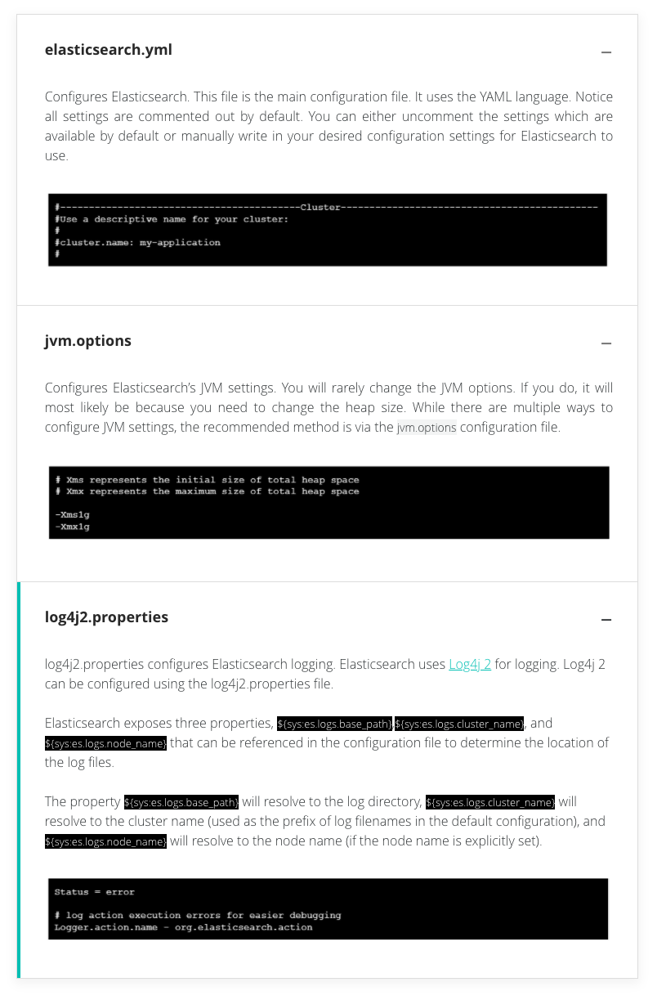
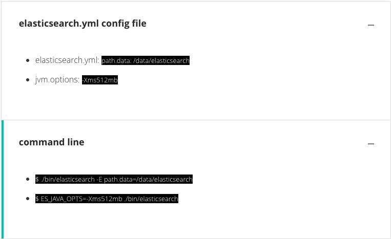
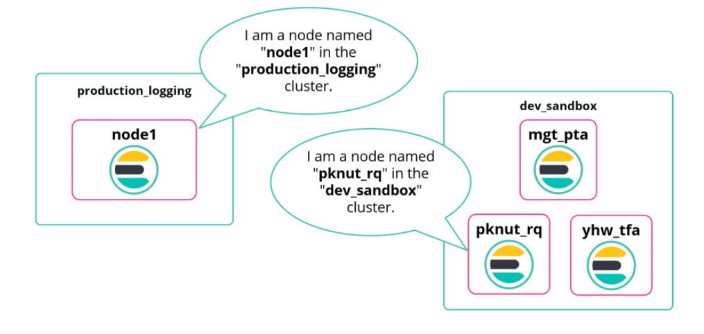

# Getting Started with Elasticsearch

## Getting Elasticsearch

Elasticsearch can be downloaded from the Elasticsearch website [here](https://www.elastic.co/start). You can also install from scratch by pulling the code from github, as Elasticsearch is open source.
***

## Preparing for Installation

Elasticsearch is a Java application, so you will need Java install on your machine. Be warned Elasticsearch is not compatible with certain versions of Java.

You should install the correct JDK, if your version of Java isn't working with your version of Elasticsearch, check the support page [here](https://www.elastic.co/support/matrix#matrix_jvm) 
***

## Installation Options

All the binaries are available on the Elasticsearch [website](https://www.elastic.co/downloads/). They are just zipped up, so you just unzip them and you have all you need to get started.

More about installation is on Elastics [website](https://www.elastic.co/guide/en/elasticsearch/reference/current/getting-started-install.html)
***

## Elasticsearch Directories

Here is a list of common directories you will see once you unzip Elasticsearch.

| Folder | Description | Setting
| ----------- | ----------- | ----------- |
| bin | Binary scripts including elasticsearch to start a node and elasticsearch-plugin to install plugins	 |
| config | Configuration files including elasticsearch.yml | **ES_PATH_CONF** |
| data | The location of the data files of each index and shard allocated on the node	 | **path.data** |
| jdk | The bundled version of OpenJDK from the JDK maintainers (GPLv2+CE) | **JAVA_HOME** |
| lib | The Java  JAR files of Elasticsearch |
| logs | Elasticssearch log files location | **path.logs** |
| modules | Contains various Elasticsearch modules |
| plugins | Plugin files location. each plugin will be contained in a subdirectory |
***

## The Configuration Files

Elasticsearch ships with some good defaults that may suit your needs, but this is configurable in Elasticsearch's config files. Some settings can also be changed on the fly without the need for a cluster restart.\
There are 3 main config files that are located in the `/config` directory


***

## Setting Properties

There are two main options for defining configuration properties on Elasticsearch; the `elasticsearch.yml` config file and the command line. The main difference is that when starting elasticsearch and configuring it using the command line becomes difficult to share if there are a lot of commands, especially if there is an issue. Whereas using the config file, it is easy to see what settings have been applied


***

## Starting Elasticsearch

After unzipping the downloaded Elasticsearch version, starting it is easy:


***

## Node

Once Elasticsearch is running you will have 1 instance of Elasticsearch running, or 1 **node** of Elasticsearch running. Every node is a member of a cluster, even if the cluster size is 1. 

### Node Name

Each of the nodes in an Elastic cluster must have a node name, this is used to identify a node running in a cluster. Elasticsearch uses `node.name` as a human-readable identifier for an instance. It is also included in many responses from Elasticsearch. This `node.name` defaults to the hostname that the machine was when Elasticsearch starts, this can be changed in the `elasticsearch.yml` file.
***

## Stopping Elasticsearch

To kill Elasticsearch you need the pid (process ID) of the instance running. if its running as a daemon (service) then you need to find the pid of the instance and run a kill command, remember you can save the pid with the `-p` flag when starting.

``` bash
$ kill 'cat elastic.pid'
```
***

## Cluster

Every node belongs to a cluster. A cluster is one or more nodes working together in a distributed manner. as a node leaves or joins a cluster, Elasticsearch will automatically reorganise itself to distribute its data across the available nodes evenly.



### Cluster Name

All nodes that belong to the same cluster will have the same `cluster.name` attribute. This will default to **"elasticsearch"** on first boot but can be changed in the `elasticsearch.yml` file.
***

# Summary

* Installing Elasticsearch can be as easy as unzipping a file!
* A node is an instance of Elasticsearch
* A cluster is one or more multiple nodes working together in a distributed manner