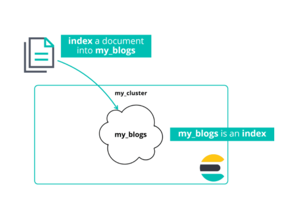

# CRUD Operations

## Documents Must be JSON Objects

With the given table we need to convert it into a JSON representation of the data shown.


Elasticsearch will only injest JSON objects. So this table needs to be converted to a JSON representation of the data.

```json
{
  "title": "Fighting Ebola with Elastic",
  "category": "User Stories",
  "author": {
    "first_name": "Emily",
    "last_name": "Mosher"
  }
}
```

---

## Document Store

Elasticsearch is a distributed document store, it can store and return complex data structures which are represented as your JSON objects. A document is a serialized JSON object which is then stored in Elasticsearch with a unique ID.

```json
{
  "title": "Solving the Small but...",
  "category": "Culture",
  "date": "December 22, 2017",
  "author": {
    "first_name": "Daniel",
    "last_name": "Cecil",
    "company": "Elastic"
  }
}
```

### Documents are Indexed into an Index

A document is indexed into an index. "index" can be used as a noun and a verb. A file can be "indexed" and an index as in the store that holds the object.



---

## Index a Document

Think of an index as a logical grouping of your data.

1. An index has a data schema-like mechanism to manage the fields of the documents in the index
2. An index has some type of mechanism to distribute data across a cluster.

To index a document the Index API can be used to accomplish indexing a document.

---

## CRUD  Create, Read, Update, Delete

You can use CRUD operations to PUT data into Elasticsearch. The JSON object will be included in the request body. You will need the index, document endpoint, and the document ID (which can be referred to later to update or add to the existing document in the index). If no ID is provided Elasticsearch will auto generate one for you. In this case you would us the verb POST if a document ID is not specified.


--- 

## Console

Working in a terminal can be tedious and long winded. Kibana has a developer tool called Console. This simplifies the requests and has feature such as tab completion and auto indent. The Console allows you to write requests quickly so you can run/test your calls with ease. These can also be copied as cURL commands.


---

## Response


This is an example of a response from a PUT request.

---

## But You Never Created the Index

The document above was indexed into the index of `my_blogs`, but we never created that index. When a document is sent to an index that doesn't exists, the index will be created automatically. Below is an example of an index being created, defining the settings and mappings ofr the index:


---

## What if the Document ID already exists?

If a document is indexed using an ID that already exists then the document gets reindexed using that same unique ID. THE `_version` number increments and the response will show that the document has been updated.

---

## The _create Endpoint

If you don't want a document to be overwritten then use the `_create` endpoint with your `PUT` request. This will response with an exception if a document with the same ID already exists.

---

## The _update Endpoint

If you want to update some fields in your document instead of overwriting it completely, then use the `_update` endpoint with a POST request. Doing this will allow you to only make changes to specific fields and the document will have the same values for the fields that were not included in the request.

Fields in the update that didn't exist will be created, fields that already existed will basically replace the value in that field.

---

## Deleting a document

Deleting a document is simply a case of using the verb DELETE to delete an indexed document.

---

### Cheaper in Bulk

The Bulk API allows you to perform many write operations in a single API call. This is useful for improving the indexing speed, or index a data stream such as log events, which can be queued up and indexed in batches of hundreds or thousands of logs.

Bulk API has four actions: **create**, **index**, **update**, and **delete**.

### Example of _bulk

The `_bulk` endpoint has a unique syntax based on lines of commands. It uses the Newline Delimited JSON (NDJSON) structure, and each command will appear on a single line.

```json
POST comments/_bulk
{"index":{"_id":3}}
{"title":"Title here","category":"cat"}
{"index":{"_id":4}}
{"title":"another title","category":"dog"}
{"update":{"_id":3}}
{"doc":{"title":"HI"}}
{"delete":{"_id":4}}
```

---

## Retrieving a Document

Use a `GET` request to retrieve an indexed document by its ID.

```json
GET my_blogs/_doc/2
```

### Retrieving multiple documents

Using the `_mget` endpoint you can get multiple documents in one request. This allows you to pull an array of documents in your `GET` request based on index and ID

```json
GET _mget
{
  "docs": [
    {
      "_index": "comments",
      "_id": 3
    },
    {
      "_index": "my_blogs",
      "_id": 1
    }
  ]
}
```

---

# Summary

* A document is a serialized JSON object that is stored in Elasticsearch under a unique ID
* An index in Elasticsearch is a logical way of grouping data
* The Bulk API makes it possible to perform many write operations in a single API call and greatly improves the indexing speed
