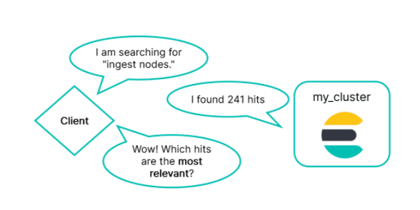
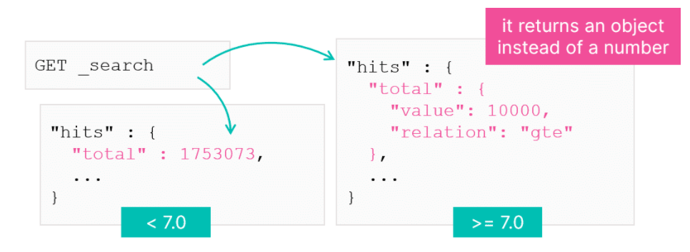

# Relevance

When querying data you are interested in the most relevant documents. How is this done? How relevant are the docs returned?



## Measuring Relevance

To understand the measurement of relevance there are some basic terms from an area of research known as Information Retrieval. Precision and Recall are 2 notions.

Ranking is the term used to describe how you order the documents according to their relevance. In ES, you use a scoring algorithm to determine a document's relevance.

* Precision
    * What portion of the returned documents are actually relevant? Usually some irrelevant documents will be mixed in with the returned document
* Recall
    * What portion of relevant documents were returned? The search engine may have missed some relevant documents.
* Ranking
    * Are the results ordered from most relevant at the top, to least relevant at the bottom.

---

## Precision and Recall

Precision the ratio of true positives over the total number of docs that were returned (true positives plus false positives). Recall is the ratio of true positives over the total number of documents that should have been returned (true positives plus false negatives).

Precision is the number of documents retrieved that are relevant divided by the total number of documents returned. Recall is the number of documents retrieved that are relevant divided by the total number of relevant documents.

---

## Improving Precision and Recall

These are inversely related. That means that improving one may result in a decline to the other. This will have to be prioritised by your use case.

* **Precision** - can be improved by making searches more strict. Use queries that only return exact matches, but this makes recall worse.
* **Recall** - can be improved by "widening the net" using queries that also return partial or similar matches. However, this makes precision worse.

---

## Total Hits

As of version 7.0, ES limits the field total count to 10,000 hits by default, this improves speed on large datasets significantly.



The `relation` field indicates whether the value field is accurate. An `eq` means `value` has the correct number of hits. The other possibility `gte` means that the numbers of hits may be grater than or equal to the count in `value`. You can force an accurate count of hits by setting the `track_total_hits` to true in the request. This will always return an accurate total number of hits, but it may take longer for the response to return.

``` js
GET _search 
{
    "total_track_hits": true
}
```

---

## Analyse the Hits

