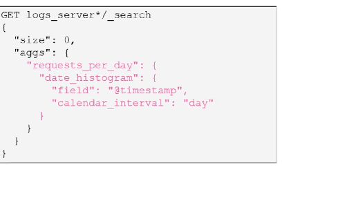
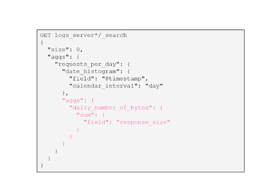
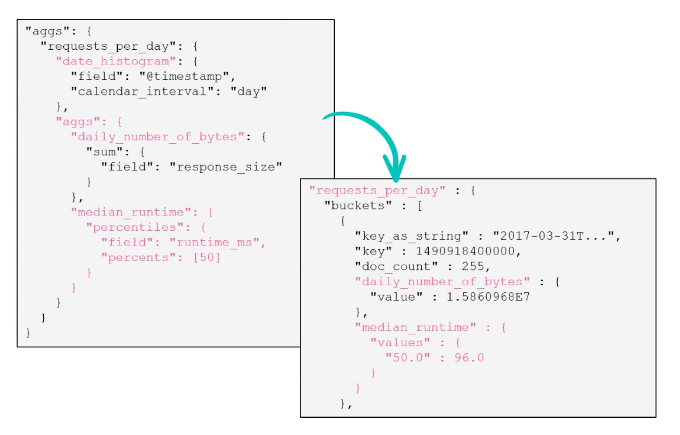
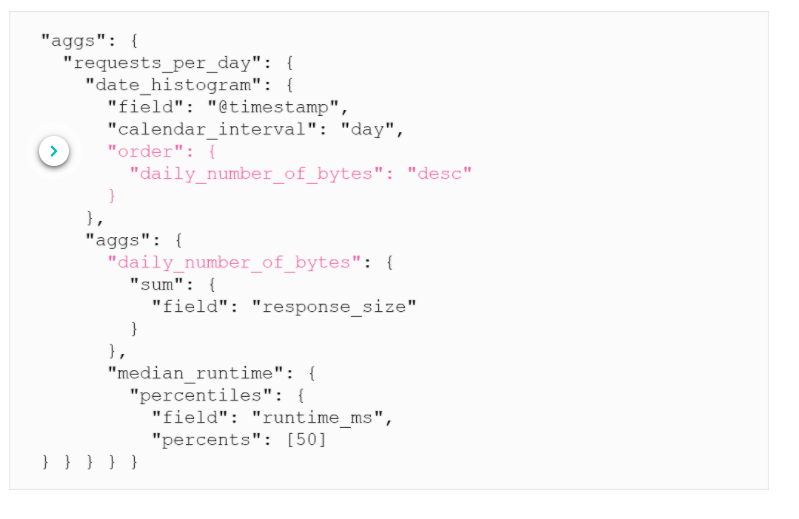
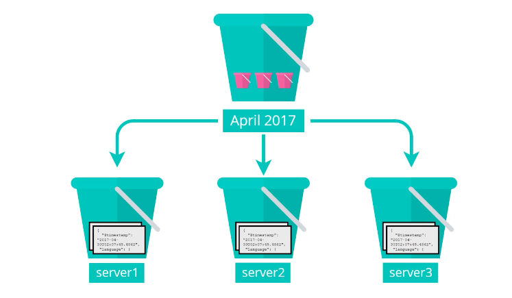
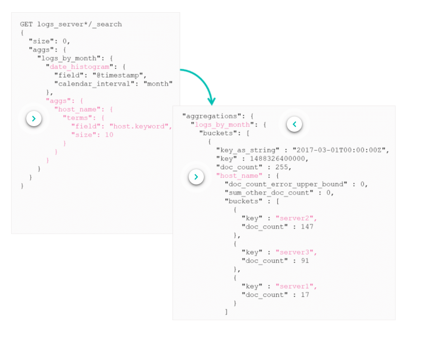
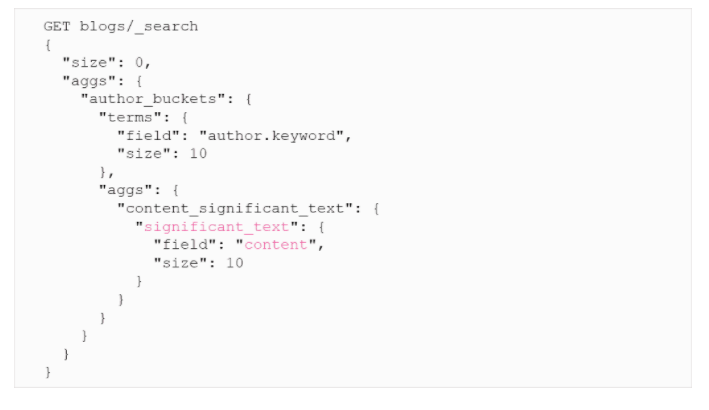

# Combining Aggregations

We have looked at metric and bucket aggregations, but some questions need these to be combined to answer some questions. 

* *What is the sum of bytes per day?*
* *What are the daily number of bytes served and median response times?*
* *What is the monthly number of bytes served per host?*
* *What are the weekly top 5 countries with respect to the number of requests?*
* *What two countries had the most unexpected number of requests per week?*
***
## Combining Buckets And Metrics Aggregations

Buckets and metric aggregations can be combined to answer these complex questions.

First we need to get the data into separate buckets, for example by day:

Then we need to apply our metric aggregation to these buckets by adding in another `args` inside the first `args`:

We can also calculate multiple metrics per bucket by just adding an extra aggregation:

***
## Sorting by a Metric

Not only can you sort a bucket by key or number of documents but you can also sort the buckets by the metric value of a sub-aggregation.

## Sub Buckets

We can also create buckets from buckets. For example if you have buckets by months, we can also get sub buckets by the hosts within each month.

This is how to write the aggregation:

***
## Top Hits Aggregation

The same way a search returns the most relevant documents, the top hits aggregation keeps track of the most relevant documents being aggregated.

Below is an example of getting the top hits from an aggregation based on a search. So first we search the content for **"logstash filters"** then we do a `terms` aggregation on that to create a bucket for each author in the results, then we do another aggregation inside that aggregation to get the top 5 hits to get the most relevant results.

***
## The Significant Aggregations
The significant aggregation works in a similar manner to the terms aggregation as it gets unique instances of some. But whats different is that it looks for the "uncommon commons", for example if you wanted to see the most visited sites in France, you wold obviously get facebook, google, youtube, etc. What significant does is looks at the common values between documents and removes the common values, like facebook, google, etc.

The above query will get all the unique authors and put them into buckets, the `content_significant_text` will then get the most common words used by using `significant_text` to filter out all the common words, like 'a', 'and', 'to', etc.

There are 2 different significant aggregations.
* `significant_terms`: aggregation should be used with the **keywords** fields
* `significant_text`: aggregation should be used with **text** fields

[This blog contains more information on significant aggregation](https://www.elastic.co/blog/significant-terms-aggregation)

# Summary
* An aggregation can be a combination of bucket and metric aggregations
* The `top_hits` aggregation returns the most relevant documents for each bucket
* The `significant_text` aggregation finds uncommonly common terms in your dataset