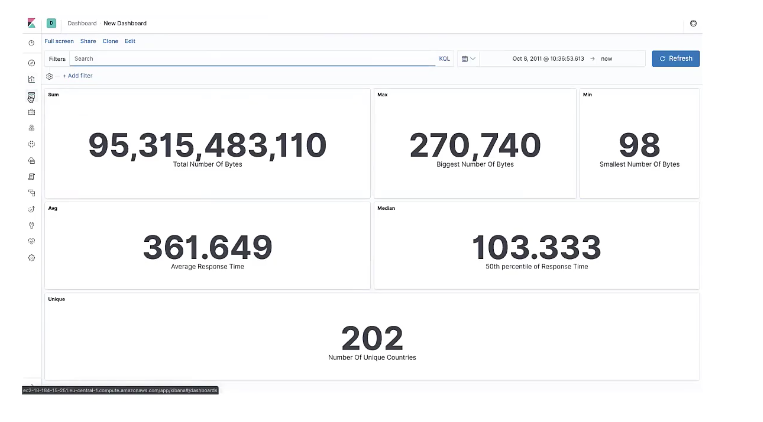
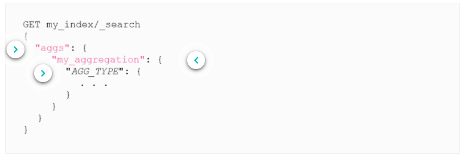
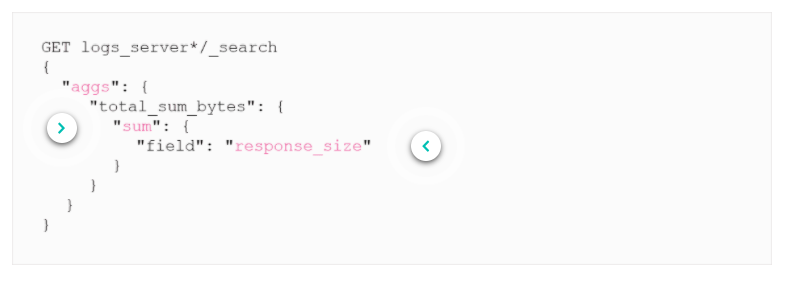
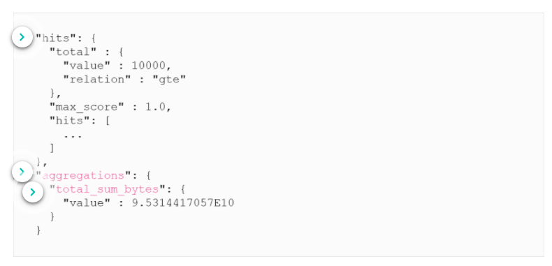
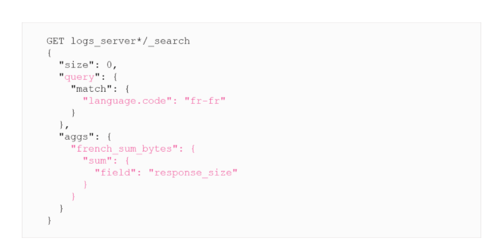
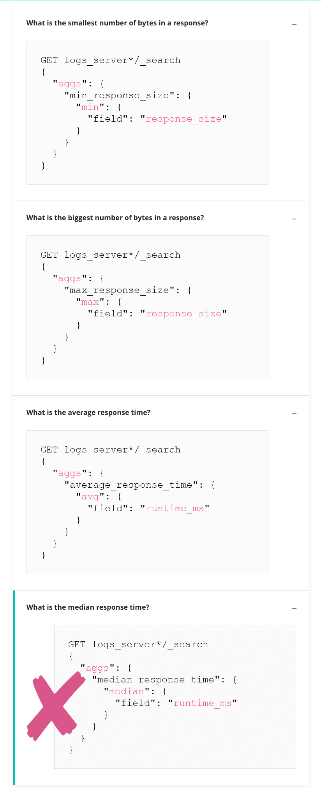
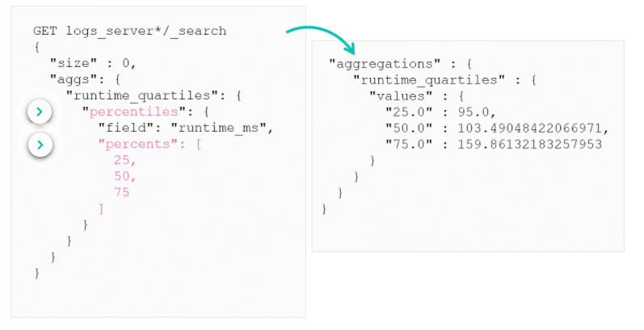
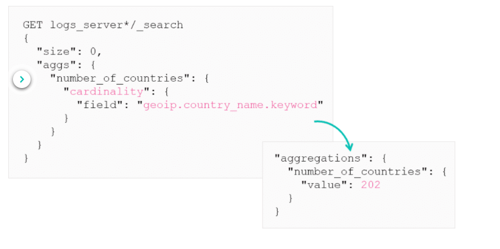

# Metric Aggregations
***
Metric Aggregations return a computed value from a set of documents. They can answers these type of questions:

* *What is the number of bytes served from all blogs?*
* *What is the number of bytes served from blogs in French?*
* *What is the average response time?*
* *What is the median response time?*
* *What is the smallest number of bytes in a response?*
* *What is the biggest number of bytes in a response?*
* *How many countries have accessed the blogs?*
***

## Metric Aggregation in Kibana

You can use the metric visualisations in Kibana to display metrics linked to an index. These will automatically create queries to display your metrics you want. You can use these visualisations to create dashboards.

***

## Aggregation Syntax

Aggregations are a part of the Search API. They can be define with or without a **query** clauses. If you define a query clause this will be ran first and the aggregation will be applied to the results of the query. 

This following aggregation answers the quest *What is the number of bytes served from all blogs?*:

***

## Aggregation Results

After running an aggregation, Elasticsearch will return a response with an aggregations section in the JSON, containing all the results from the aggregation defined in teh search request.

By default Elasticsearch will return the top 10 results, if you are not interested in the top 10 results then you can set the `size` parameter to 0 and this will return no results. This saves on computing resources as Elastic doesn't have to compute the score.
***

## Aggregation Scope

The previous examples run the aggregation on the entire index. If you want to run the aggregation on a subset of documents you can just query the index first then run the aggregation.
The following answers the question *"What is the sum of bytes where the lanuage code is French?"*

***
## Aggregation Examples

Here are some example questions answered using aggregations:

> **Median aggregation does not exists, we will look how this is accomplished using another aggregation**
***

## Percentiles Aggregation

To compute a median of a numeric field we can use the `percentiles` aggregation. This is a multi-value aggregation that allows us to calculate the specific percentiles of a field.

The 50th percentile will be the median of this data.
***

## Cardinality Aggregation

To answer the question *How many countries have accessed the blog?* we need to use the `cardinality` aggregation.

This aggregation calculates the count of distinct values for a given field. Be aware this is a approximation. This is based on teh **HyperLogLog++** algorithm which trades accuracy over speed.
***
[More about metric aggregations can be found here](https://www.elastic.co/guide/en/elasticsearch/reference/current/search-aggregations-metrics.html)
***

# Summary

* Metric aggregations compute numeric values based on your dataset such as:
    * Min
    * Max
    * Avg
    * Stats
* Use the **percentiles** aggregations to calculate values for different percentiles, such as the 50th percentiles (median)
* Use the **cardinality** aggregatino to calculate unique counts.