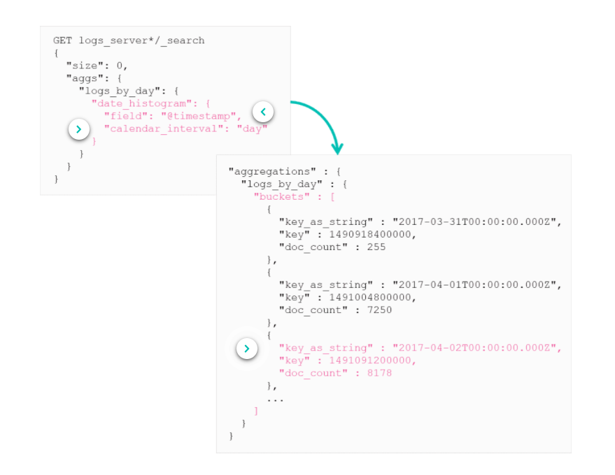
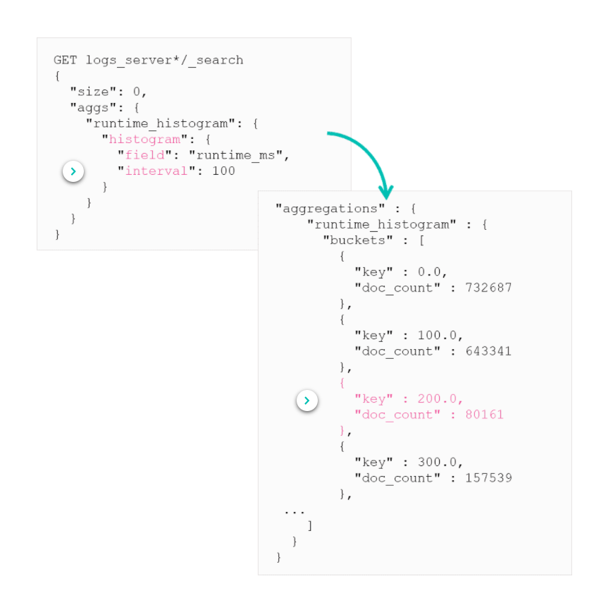
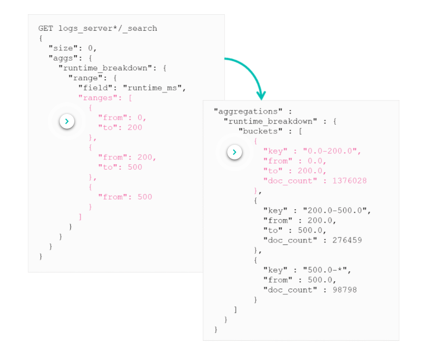
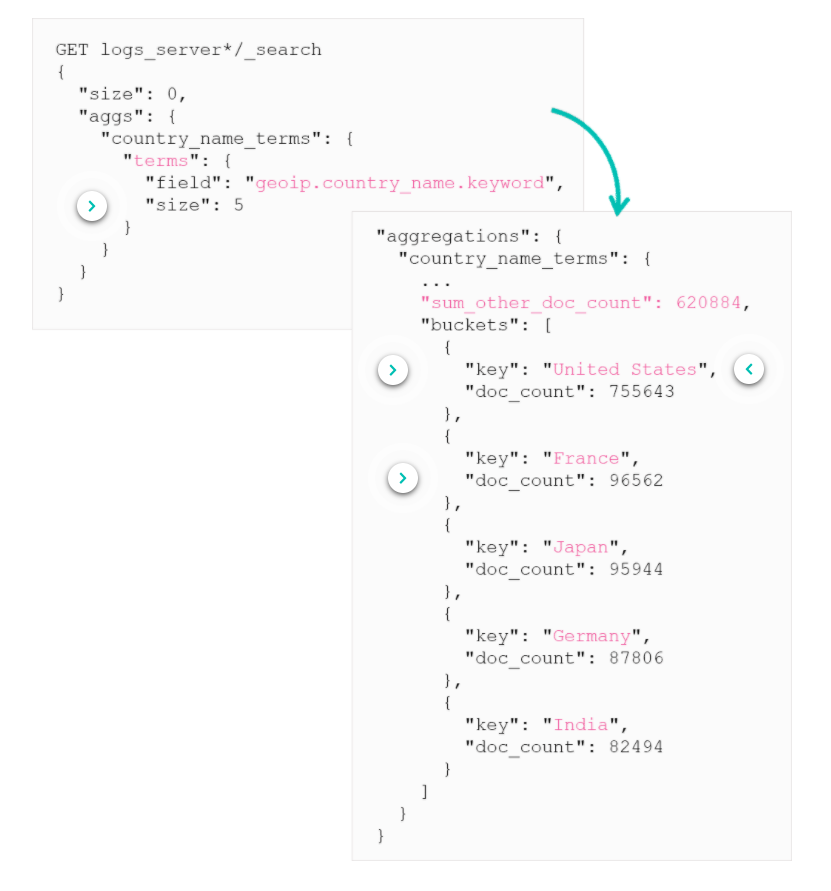
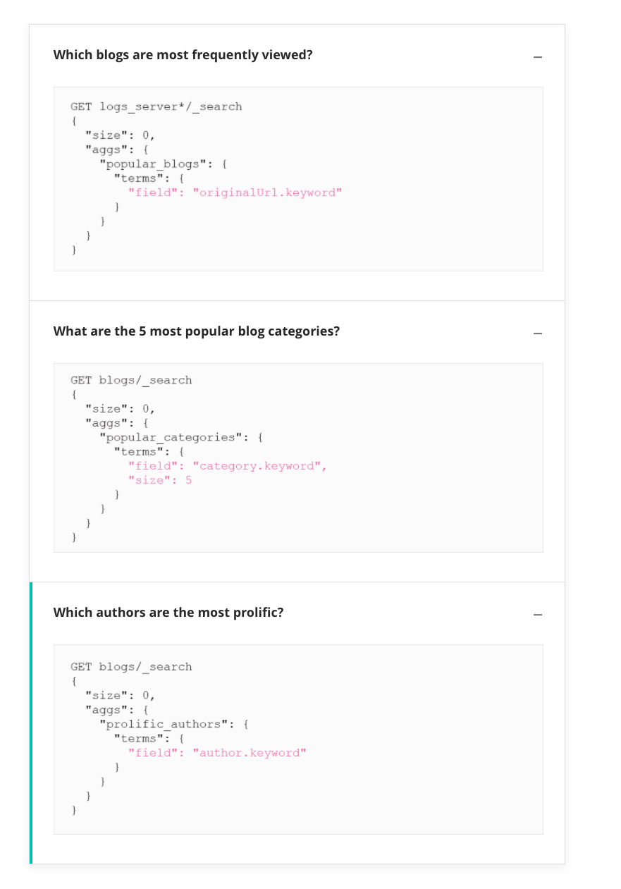
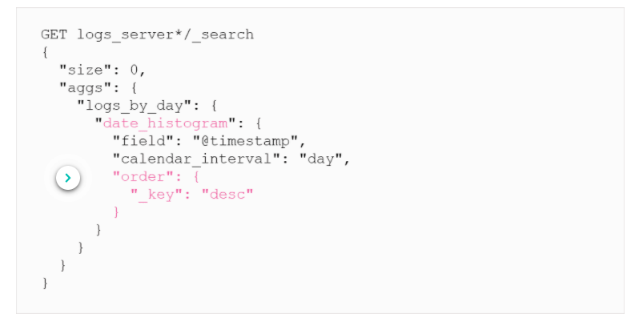

# Bucket Aggregations

Bucket aggregations are useful for finding out metrics on specific sets of data which is put into separate buckets. 

## What is a bucket

So we aggregate some data, for example every month, and each month is a separate bucket with data inside relating to that day. 

We can then run queries against these buckets and get metric data from them.

## Date Histogram Aggregation

The `date_histogram` aggregation puts documents into buckets based on a given time interval. An aggregation response contains a "buckets" array with the data inside each of these buckets by the aggregation applied to it. 

There are 2 ways to define the interval for this aggregation:
* `fixed_interval`: This parameter has preset intervals values which is always constant
* `calendar_interval`: This parameter knows about daylight savings and that months have different amount of days in them
    * The length of each interval may vary

This example shows "How many requests reach our system every day?".

We can use this data inside a Kibana visualisation to display the data.

## Histogram Aggregation

This is similar to the previous aggregation but can be applied to any numerical field.

Example: Overview of the distribution of the response times of logs:

## Range Aggregation

In the previous aggregation the interval had the same preset size. If you want your own custom intervals then you can use the range bucket aggregation.

Example: "How many requests took between 0-200, 200-500, 500-* ms?"

## The Terms Aggregation

This will dymically create a bucket for each unique term it sees in the given field. 

For example: "What are the top 5 countries that visited our blogs?”

Here is a few examples of other uses of terms aggregation:

***
## Bucket Sorting

Each aggregation sorts the buckets based on different values, for example the terms aggregation sorts by `doc_count` values, date histogram sorts by `key` values.

To change this you need to add an optional parameter, `order`. This has 2 built in fields:
* `_count`: sort buckets by number of documents
    * This is the default for the `terms` aggregation
* `_key`: sort buckets by their `key` values
    * This is the default for `date_histogram` and `histogram` aggregations

[All bucket aggregations are located on the elastic site here](https://www.elastic.co/guide/en/elasticsearch/reference/current/search-aggregations-bucket.html)

***
## Summary

* A **bucket** is a collection of documents that shares some common criteria
* The **terms** aggregation will return a specified number of buckets of the most commonly seen values in a field
* Some bucket aggregations allow you to specify the sort "**order**"