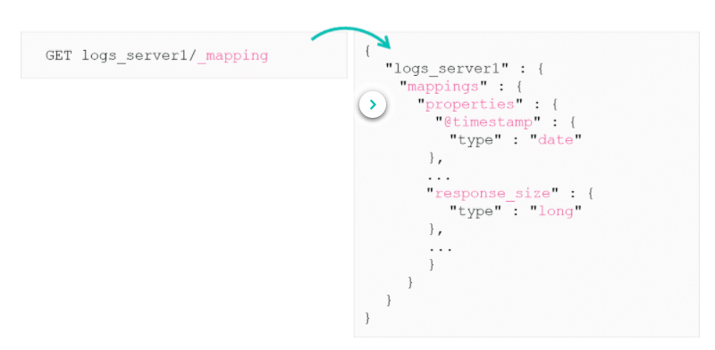
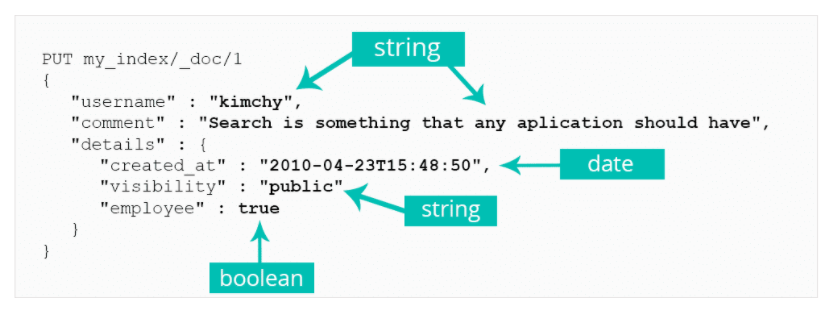
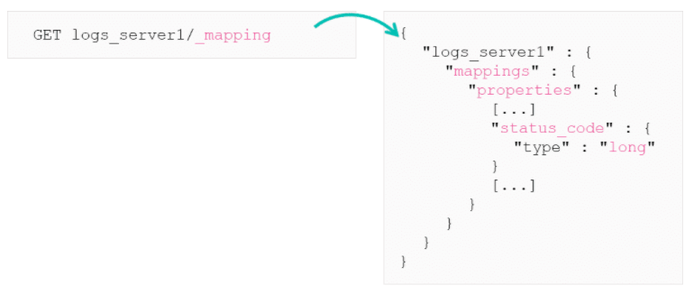
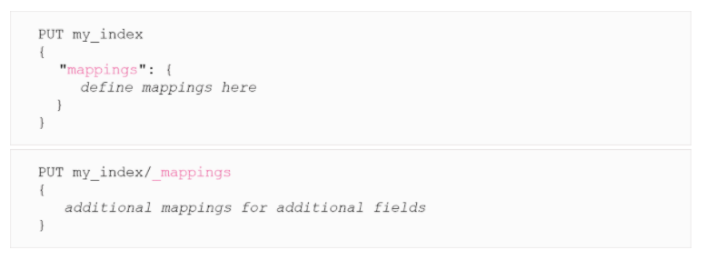

# What Is A Mapping

Elasticsearch will happily take any data you throw at it and will automatically map the data types. A mapping is just a schema definition that contains the names and data types of the fields in an index. It also contains information on how the data should be indexed and stored by Lucene.

To inspect a mapping of an existing index you can use the `_mapping` endpoint.

## Field Data Types

These are several data types that Elasticsearch supports

A full list can be found [here](https://www.elastic.co/guide/en/elasticsearch/reference/current/mapping-types.html)
***

## Dynamic Mappings

You can index documents without having to define mappings. Elasticsearch will dynamically create mappings based off the JSON it is given. It will take care of creating and updating the mappings for each push of data.

By looking at the JSON Elasticsearch will automatically guess the associated data type for that field.

Elasticsearch can also recognise many standard date formats.
***

## Custom Mappings

Sometimes the dynamic mappings provided by Elasticsearch isn't always optimal. For example if you are pushing an index that has the field `status_code`, elastic will index this with a mapping of `long` type which is 64 bits.

A status will never be more than 511, so this field should be typed as a `short`

To do this you need to define your own mappings on the index. This will optimise the performance of the cluster.

***

## Can you change a Mapping?

It is not possible to change a data type for an existing field in an index. Trying to do so would change the data structure Lucene uses to store all the values in that field. Instead you can either create a new index with the correct data type and re index all the files or add a new field with the correct data type.
***

## A word on Types

Documents in Elasticsearch version prior to 8.0 each have a document type (aka mapping type). This was used to index documents having different mappings into the same index. The `_type` indicated which mapping you wanted to use for that index. This was decided to be poor design and have removed document types. 

8.0 versions and above have removed support for document types altogether. More info can be found [here](https://www.elastic.co/guide/en/elasticsearch/reference/current/removal-of-types.html)
***

# Summary

* Mappings are an Elasticsearch data schema
* One mapping is defined per index
* If you do not define an explicit mapping, Elasticsearch will dynamically map the fields in your documents
* You cannot change the mapping of a field after the index has been created
* You can add new fields to a mapping
* You should customize your mappings so Elasticsearch can index and query your data most efficiently