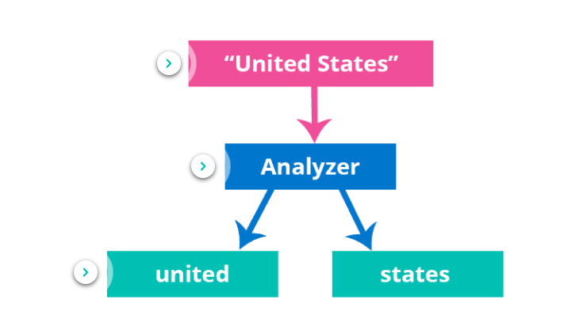
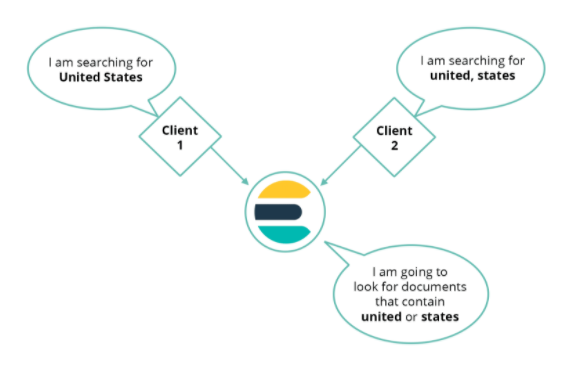
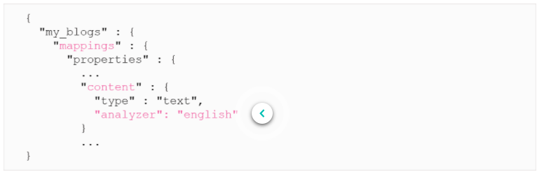
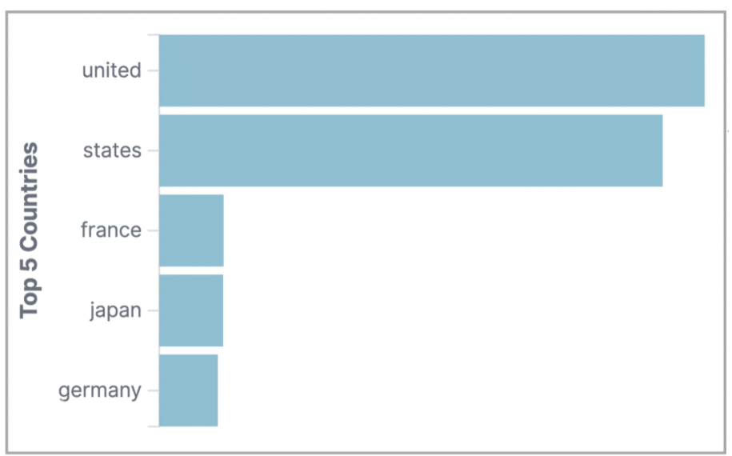
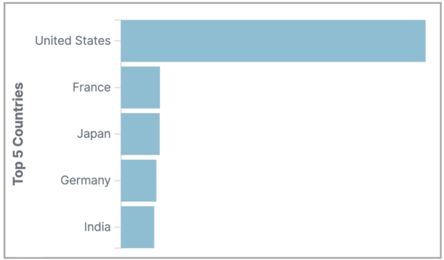
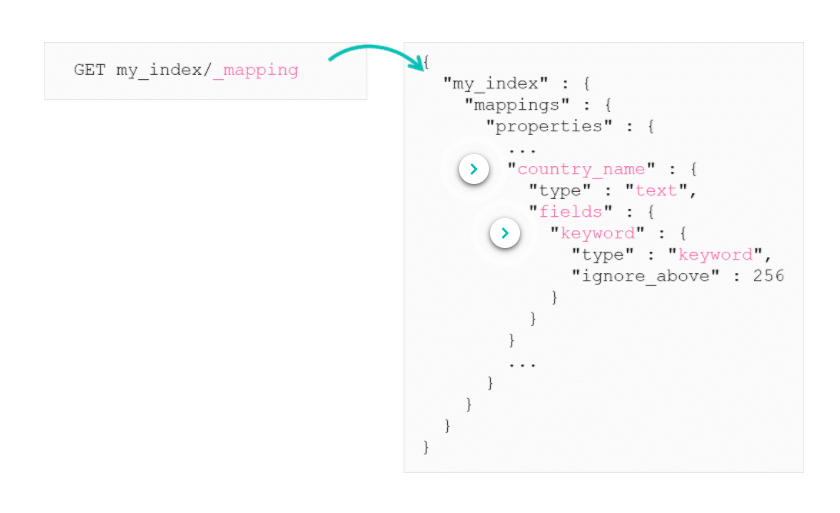
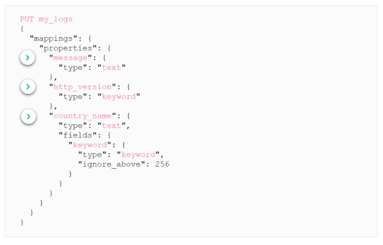

# Text and Keyword Strings

## Text Analysis

Whenever you index strings it is passed through an analyser, the default analyser is called the standard analyser. This will break up the strings into token (individual words) and lowercases them and remove punctuation.

When you run a search for "United States" for example, this search query is also passed through the standard analyser. A match query will send the two separate queries for each of the tokens ("united", "states") whose result will be combined in something like a boolean should clause.

Elasticsearch applies the standard analyser by default to text fields. There are many different analysers built into elastic, which can be found [here](https://www.elastic.co/guide/en/elasticsearch/reference/current/analysis-analyzers.html). There is also community built analysers which can be found [here](https://www.elastic.co/guide/en/elasticsearch/plugins/current/analysis.html).

You can also create your own custom analysers if the ones built in and community ones do not serve you purpose.

This is how to apply a different analyser to a field:

***

## Difference between text and keyword

Text analysis is good for full-text search, but it is not good for things like aggregations where you would want to see the original strings. E.g.

Instead you would want to actually see the full field like this:

To achieve this you need to use the data type keyword, Elasticsearch has 2 types of string data types:

* Text data type - used for full-text search
    * Text fields are analysed and resulting tokens are stored in Elasticsearch
* The keyword data type - used for aggregations, sorting, and exact searching
    * The keyword fields are not analysed
    * Elasticsearch stores the original strings
***

# Multi Fields

Elasticsearch doesn't know how you will use your text data, whether for searches or aggregations. So Elasticsearch will index text fields as both keyword and text data types. This is achieved by using Multi-fields.

When you inspect a mapping of some index that has text data that you have indexed, you can see that not only has elastic store the type of the data as text but inside that object it has also created a `fields` object. This contains all the different multi-fields associated to this field. To access the keywords we use `<name_of_field>.keyword`.

***

# Optimised Mappings

Multi fields by default are helpful, but they come at a cost. It is more expensive to be storing all text data twice, takes longer to index and takes up more storage. You need to think about how a string will be used in elastic and decide what mapping is best for that particular piece of data.

***

# Summary

* Elasticsearch has two kinds of string data types: text and keyword
* Text fields are for full-text search
* Keyword fields are for exact searches, aggregations, and sorting
* By default, every string gets dynamically mapped twice: as a text field and as a keyword multi-field
* You can optimize your mapping by choosing either text or keyword explicitly (or both!)