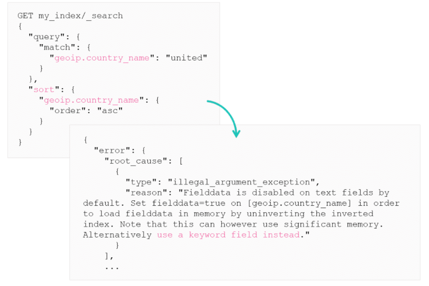
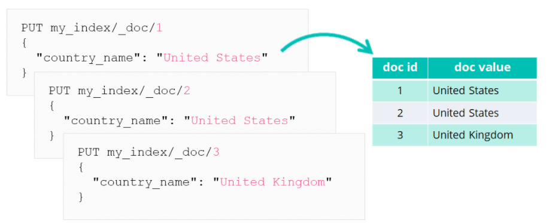
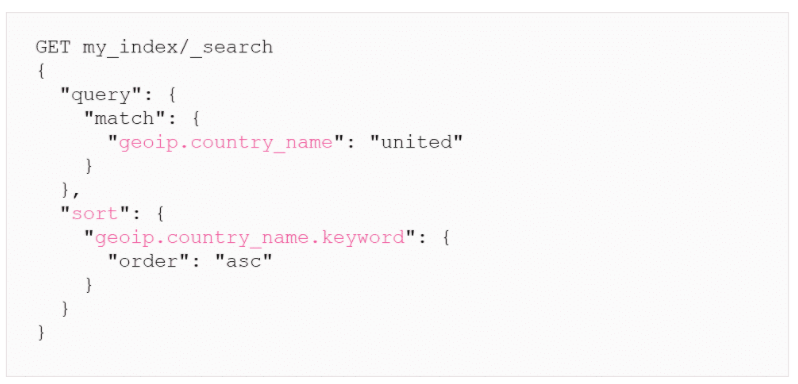

# The Inverted Index and Doc Values

## What is an inverted index?

An inverted index is similar to an index at the back of a book. The index in a book has words with a page number on it. The inverted index does something similar, it stores the words that are read by the standard analyser and stores them in a table that related to the doc id that the words appear in. So if you index these:

```
PUT my_index/_doc/1
{
    "country_name": "United States"
}

PUT my_index/_doc/2
{
    "country_name": "United States"
}

PUT my_index/_doc/3
{
    "country_name": "United Kingdom"
}
```

You will end up with an inverted index table like this:

| term | doc_id |
| ----------- | ----------- |
| united | 1, 2, 3 |
| states | 1, 2 |
| kingdom | 3 |

This is how Elasticsearch can search so quickly. Instead of searching all the data for the words, it will simply look at the inverted index and return the doc_id of matching words.
***

## Limitations to the inverted index

The inverted index is great for search but has some limitations. For example, if you try to sort the results by `country_name` field, you will get the following error. This error will suggest to use the `keyword` field over uninverting the inverted index.


***

## Doc Values

To sort, aggregate or script on analysed (text) fields, it is recommended to use the `keyword` field. This is because the keyword fields have doc values.

Doc values are another type of data structure that have a columnar structure which is much better for aggregations, etc. 

Doc values are not supported for analysed fields. All other field types will create a doc value in addition to the inverted index.

For each document, a new entry is added inside the table referencing the field value with its document ID:




To sort or aggregation on a string field you should use the keywords field. These have doc values by default which allows you to use it for aggregations or sorting easily.


***

## Optimising the Mappings

Here are some ways to optimise a mapping

* Not indexing a field
    * This will render a field unable to be queried, but can still be aggregated on etc.
    * syntax: `"index":false`
* Disabling Doc Values
    * This will render a field unable to be aggregated on etc. but can still be used in searches.
    * syntax: `"doc_values":false`
* Disabling a field
    * This will stop a field being index and stop it from being stored in the `doc_values`. It will still be stored in `_source`, it only impacts the inverted index and doc values.
    * syntax: `"enabled":false`
* Disabling an object
    *This will skip the indexing of an entire JSON object. Cannot be used for searches or aggregations
    * syntax: `"enabled":false`
***

# Summary

* Lucene builds multiple data structures out of your documents: inverted indices and doc values
* The inverted index make searching fast
* Doc values allow you to aggregate and sort on values
* You can disable the inverted index or doc values for individual fields in the index's mapping to optimize storage