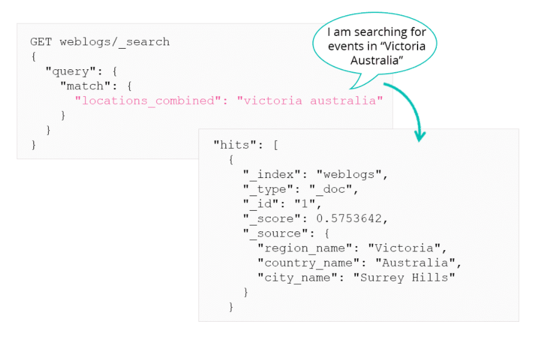

# Custom Mappings

## Mapping Parameters

There are various parameters that can be applied to fields on documents. We know of the 2, `index` and `doc_values`. There is a complete list [here](https://www.elastic.co/guide/en/elasticsearch/reference/current/mapping-params.html)
***

## Specifying a Date Format

Elasticsearch will automatically detect if a string is a date. But if your date format is not standard ISO, you will need to define a custom mapping for the date. there are lots of [built-in date formats](https://www.elastic.co/guide/en/elasticsearch/reference/current/mapping-date-format.html), or you can define your own.


***

## `copy_to`

Consider this data: 

```json
{
    "region_name": "Victoria",
    "country_name": "Australia",
    "city_name": "Surrey Hills",
}
```

If you want to search on all three of these fields in one query, you could run a bool query with `should` cause in a `must` clause. Or you could copy all three values into a single field during the indexing phase using the `copy_to` parameter.

This parameter will combine multiple fields into 1 field:

```json
{
    "mappings" : {
        "properties": {
            "region_name": {
                "type": "keyword",
                "copy_to": "locations_combined"
            },
            "country_name": {
                "type": "keyword",
                "copy_to": "locations_combined"
            },
            "city_name": {
                "type": "keyword",
                "copy_to": "locations_combined"
            },
            "locations_combined": {
                "type":"text"
            }
        }
    }
}
```

Now when a document is indexed the three fields will be combined into `locations_combined`. This field will not be a part of `_source` as it didn't exist in the original file. But an inverted index will be created for it so it can be searched.


***

## Coerce Data

By default, Elasticsearch will try to coerce data to match the data type of the field. This basically means Elasticsearch will attempt to "clean" dirty data coming in. For example if you index this data:

```
PUT ratings/_doc/1
{
    "value": 4
}
PUT ratings/_doc/2
{
    "value": "3"
}
PUT ratings/_doc/3
{
    "value": 4.5
}
```

Elasticsearch will automatically coerce the data to match the first data type (`long`). So doc 2 will become a long 3 and doc 3 will truncate the .5 and it will become a 4. You can disable this default behaviour on a field like so.

```
PUT ratings
{
    "mappings": {
        "properties": {
            "value": {
                "type": "long",
                "coerce": false
            }
        }
    }
}
```

This means if you attempt to do the second PUT request it will fail as Elasticsearch is expecting a long and is receiving a string.
***

## Null values

If a field has a value of `null` then it is treated as no value. You can change this by adding a `"null_value": ...` parameter to the field mapping.

```
PUT ratings
{
    "mappings": {
        "properties": {
            "rating": {
                "type": "float",
                "null_value": 1.0
            }
        }
    }
}
```

This way if any `value` in the `ratings` index is null, it will be replace by `1.0`.
***

## Defining your own mappings

Best way to define your own mappings is to use elasticsearch itself by following these steps:

1. Index a sample of documents that contains the fields you want defined in the mapping to a temporary index.
2. Get the dynamic mapping created by Elasticsearch from this index.
3. Edit the mapping definition to suit your needs.
4. Create your index using your explicit mappings and then you're ready to ingest data.
***

## Dynamic Templates

Defining your own mappings is good but can be tedious if you have indices with a large number of fields or some field names are currently unknown. Here is where dynamic templates come in.

These allow you to dynamically assign a mapping to unmapped fields. these are applied based on these conditions:

* The data type of the field
* The name of the field
* The path to the field

Here is an example of using dynamic templates to map unmapped string fields to be mapped as type `keyword` only.

```
PUT test2
{
    "mappings": {
        "dynamic_templates": [
            {
                "my_string_fields": {
                    "match_mapping_type": "string",
                    "mapping": {
                        "type": "keyword"
                    }
                }
            }
        ]
    }
}
```
***

# Summary

* Mapping parameters allow you to influence how Elasticsearch indexes the values for particular fields in your documents
* Dynamic templates make it easier to set up custom mappings by defining field data types based on their JSON type, name, or path