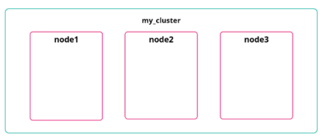
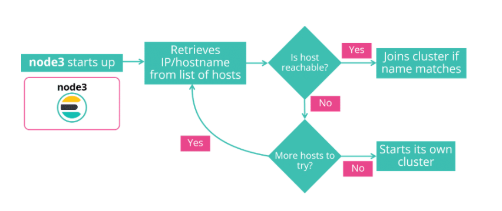
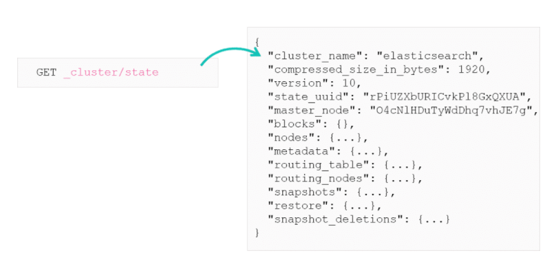
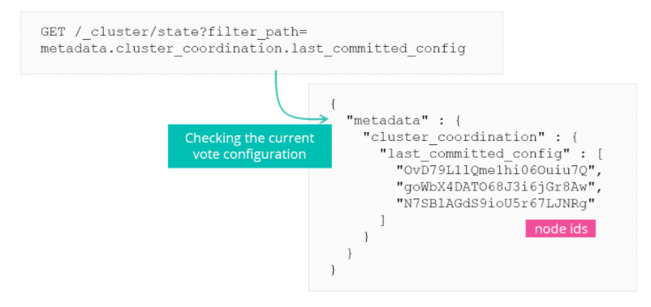

# Master Nodes

## Creating an Elasticsearch Cluster

When you first start Elasticsearch it will create a node as a part of a cluster. Each node shares the same `cluster.name` attribute, located in the `elasticsearch.yml` file. Elasticsearch will automatically reorganise itself and distribute the data across the available nodes.


***

## Elasticsearch Communication

There are 2 important communication mechanisms to understand in Elasticsearch:- HTTP and Transport

* HTTP exposes the Elasticsearch REST APIs
* Transport is used for internal comms between nodes within the cluster

### HTTP Communication

The HTTP module binds to `localhost` by default and is configured with `http.host`. The default port is between **9200-9299** and is configured with `http.port`.


### Transport Communication

Each call that goes from one node to another uses the **transport** module. If a GET request hits a node and that node needs to get the data from another node, then it will internally use the transport module to communicate with the other node.

Transport binds to `localhost` by default and is configured with `transport.host`. Default port is `9300-9399` and is configured with `transport.tcp.port`.


***

## Configuring Network Settings

There are 3 ways to configure the network settings:

| Setting | Description |
| ----------- | ----------- |
| `transport.*` | Specify settings for the transport protocol |
| `http.*` | Specify settings for the http protocol |
| `network.*` | Specify settings for both the protocols in one setting |

When configuring hosts, you can specify binding and publishing together, or separately:

| Setting | Description |
| ----------- | ----------- |
| `*.bind_host` | Interface to bind the specific protocol to |
| `*.publish_host` | Interface used to advertise for other nodes to connect to |
| `*.host` | Specify both bind and publish in one setting |
***

## Binding and Publishing

Each node advertises a single `publish_host` interface to other nodes so they can all connect to this. At the same time the node listens on one or more `bind_host` interfaces for incoming requests.

## Special Values for network.host

These are some special values that can be used for `network.host` to help avoid using hard-coded IP addresses in your config files:

| Value | Description |
| ----------- | ----------- |
| `_local_` | Any loopback address on the system (e.g. 127.0.0.1) |
| `_site_` | Any site-local address on the system (e.g. 192.168.0.1) |
| `_global_` | Any globally -scoped addresses on the system (e.g. 8.8.8.8) |
| `_[networkinterface]_` | Address of a network interface (e.g. \_en0\_) |
> `network.host: _site_` is a common setting
***

## Discovery Module

This is responsible for discovering nodes within a cluster.
Give a list of **seed hosts**, a node issues ping requests to find other nodes on the same network to join a clust.



## Seed Hosts Providers

The cluster formation module offers two seed hosts providers to configure the list of seed nodes: settings-based and file-based. Can be extended to support cloud environments and other forms of seed hosts providers via [discovery plugins](https://www.elastic.co/guide/en/elasticsearch/plugins/current/discovery.html)

Static:
```
Discovery.seed_hosts: ["server1", "server2", "server3"]
```

Dynamic
```
Discovery.seed_providers: file
```
```
$ ES_PATH_CONF/unicast_hosts.txt
```
```
server1
server2
server3
```
***

## Cluster state and master nodes

To get the metadata on a cluster we can use the cluster state API. To view a clusters state use `_cluster/state`



The response is an internal representation of the cluster state.

## The Master Node

The cluster state is stored on each node, but can only be changed by the master node which then propagates this information across the cluster.

The master node is elected through a voting process, this takes all master eligible node (on by default for all nodes) and runs a voting process in which all nodes vote on a node to become master. If the master node goes down another vote is taken and a new master node is chosen.

## Voting Configuration

Each cluster has a voting configuration, which is the set of voting nodes whose responses are counted when making decisions such as electing a new master. The decision is made when more than half of nodes in teh voting chose the same candidate.



## Bootstrapping a Cluster

When starting a cluster for the very first time, you must provide an initial set of master-eligible nodes. To hold the election of a master node Elasticsearch needs to know the list of nodes which are eligible to vote. This initial voting configuration is known as the bootstrap configuration and is set in the cluster bootstrapping process.

```
cluster.initial_master_nodes: ["node1", "node2", "node3"]
```

Once the cluster is formed, this setting is no longer required and is ignored.

> `cluster.initial_master_nodes` must be set to the same list of nodes on each node to ensure only a single cluster is formed during bootstrapping and therefore avoid the risk of lost data.
***

# Summary

* Elasticsearch uses two network communication mechanisms: HTTP for REST clients; and transport for inter-node communication
* The details of a cluster are maintained in the cluster state
* Every cluster has one node designated as the master
* You need to bootstrap the Elasticsearch cluster when you start it for the very first time