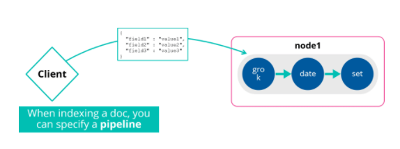

# Node Role

Out of the box nodes can do different things, a node can be many things or have a single purpose

***

## Configuring Node Rules

By default a node is master-eligible, data, ingest and machine learning node.

| Node type | Configuration parameter | Default value |
| ----------- | ----------- | ----------- |
| master eligible | `node.master` | true |
| data | `node.data` | true |
| ingest | `node.ingest` | true |
| machine learning | `node.ml` | true |
***

## Data Nodes

These have 2 main features:

* Hold the shards that contain documents you have indexed
* Execute data related options like CRUD, search and aggregation
***

## Data Nodes Scale

Data nodes handle a lot of work, as the operations they perform are I/O, memory and CPU intensive. These must be monitored and if they are getting overwhelmed you need to add a new data node to ease the pressure.
***

## Ingest Node

These provide a pre-process to a document just before it gets index. You can apply transformations to a document and then pass the document back to the index/bulk APIs.

There is no parallelism in ingest nodes. They handle requests sequentially like any indexing. If you have heavy ingests it makes sense to use dedicated ingest nodes.
***

## Machine Learning Nodes

These automatically models the behaviour of your data, trends, periodicity and more in real time. Helps to identify issues, streamline root cause analysis and reduce false positives.

These nodes provide the ability to run machine learning jobs along with handling machine learning API requests. They are configured using the `node.ml` property. They have `xpack.ml.enabled` and `node.ml` set to true.

More information is found [here](https://www.elastic.co/guide/en/elastic-stack-overview/current/xpack-ml.html)
***

## Coordinating Node

This receives and handles requests. Ever node is implicitly a coordinating node.

When a request is received this node will find the appropriate node(s) and forward the request, then rebuild everything into a response.
***

## Sample Architectures

* 1 Node cluster - good for testing and dev
* 2 Node cluster - not ideal, as if 1 node goes down the cluster is unavailable
* 3-5 Node cluster - Small production cluster. 3 master eligible nodes is preferred
* Larger clusters - 7+ is considered a large cluster. Nodes should start having dedicated roles.
***

# Summary

* There are different node roles and nodes can have one or multiple roles at the same time
* Data nodes hold shards and execute data-related operations like CRUD, search, and aggregations
* Ingest nodes can pre-process documents before indexing to Elasticsearch
* Machine learning nodes can run machine learning jobs
* Larger, high-volume clusters should have dedicated nodes to improve performance and resource usage