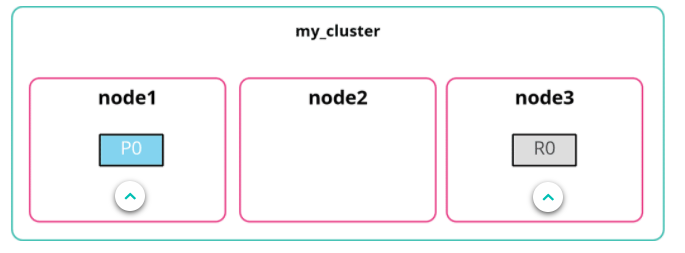
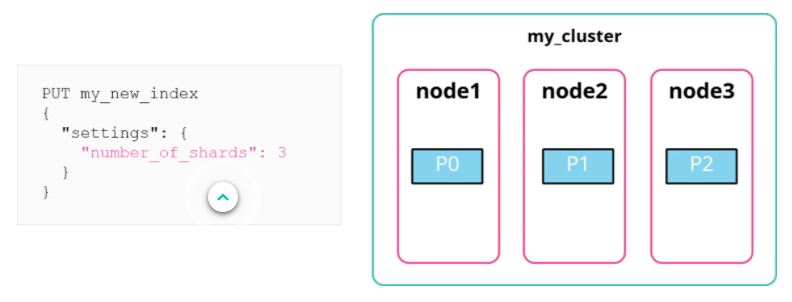
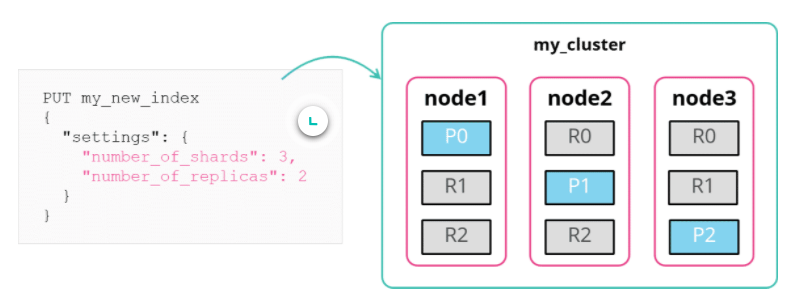
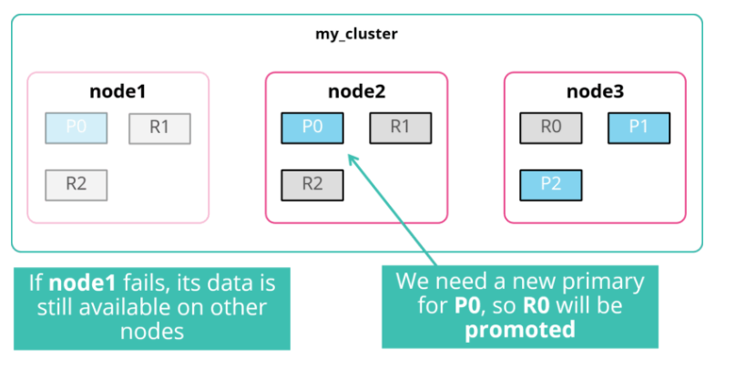
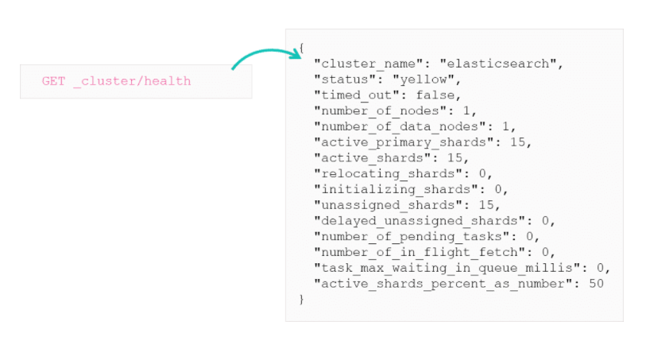

# Understanding Shards

An index is an abstract object, a virtual namespace, which points to a number of shards. An index basically keeps track of the shards and where things are. 

There is no such thing as an index on disk. Shards exist on disk, which is a worker unit that holds the data and can be assigned to nodes.
***

## Primary vs. Replica

There are 2 different types of shard:

* Primary: the original shards of an index
* Replicas: copies of the primary

All documents are replicated between a primary and its replica shards. These shards are guaranteed to be on different nodes to increase failover. Its basically a copy of the data on a different node.

***

## The Shards of the Blogs Dataset

When an index is created it always has some number of shards. When created the number of primary shards will be 1 unless you specify differently.

> Any modifications to the primary shard number are costly and have strict limitations

The blogs index has 1 node, with the default of 1 primary shard with 1 replica. Primary and replicas cannot be on the same node. So what happens?
***

## Scaling Elasticsearch

Having a 3 node cluster for example means the shards can easily be distributed. In a 1 node cluster your replicas will not be on the node where your primary shard is, they are unassigned.

Adding nodes to your cluster will cause a **reallocation of shards** and the creation of replicas (if enough nodes exist). The master node is responsible for the allocation of shards.
***

## Configuring the Number of Primaries

You can specify the number of primaries when an index is created but not afterwards. Syntax is below:

***

## Why 1 instead of 5 Primaries?

By default in previous versions of Elasticsearch (<7.0) you would get 5 primary shards and 1 replica per primary when creating an index. This was causing over-sharding.

Over-sharding is when there is too many shards consuming resources for no reason. So 1 daily index on 5 shards was creating 50 shards per day. The default was reduced to 1 primary shard and the Index Lifecycle Management (ILM) was brought in.

A shard can hold 10s of gigabytes of data. If more are needed, multiple indices make it easy to scale along with the split API, which allows you to increase the number of shards.
***

## Configuring the Number of Replicas

The default is 1. So each primary will have 1 replica. You can specify the number of replicas when creating an index with the `number_of_replicas` setting. This can be changed at any time.

***

## Why Create Replicas?

High availability. If a node goes down the replicas are promoted to primaries as needed. 

Replicas also allow high throughput. When querying your data you don't care if its the primary or replica shards being searched, they all contain the same data.
***

## Cluster Health and Shard Allocation

The cluster health endpoint contains various details and metrics of the cluster.

***

## Health Status

The health status is defined as either green, yellow or red and exists at three levels.

* Cluster Health: The status of the worst index in the cluster.
* Index Health: The status of the worst shard in that index.
* Shard Health
    * Red: at least one primary shard is not allocated in the cluster.
    * Yellow: all primaries are allocated but at least 1 replica is not.
    * Green: all shards are allocated.

The 'color' state of the cluster represents the least healthy index on the cluster, so 10 green indices and 1 red index  red cluster.

## Shard Allocation

Shards go through several states:

* UNASSIGNED
* INITIALIZING
* STARTED
* RELOCATING

Elasticsearch manages these automatically and there is no need for manual intervention.

## UNASSIGNED Shards

This describes a shard that exists in the cluster state but cannot be found in the cluster. The cluster knows the shards should be there but it can't allocate them.

Some example for UNASSIGNED state:

* When more replica shards are assigned than nodes.
* A node failed and replica shards are down.
* A brand new index was created and the shard is being created

***
> More information can be found [here](https://www.elastic.co/guide/en/elasticsearch/reference/7.4/allocation-awareness.html)
***

# Summary

* Elasticsearch subdivides the data of your index into multiple pieces called shards
* Each shard has one (and only one) primary and can have zero or more replicas
* Default settings are 1 primary shard and 1 replica
* Shard allocation is the process of assigning a shard to a node in the cluster
* A cluster’s health status is either green, yellow, or red depending on the current shard allocation