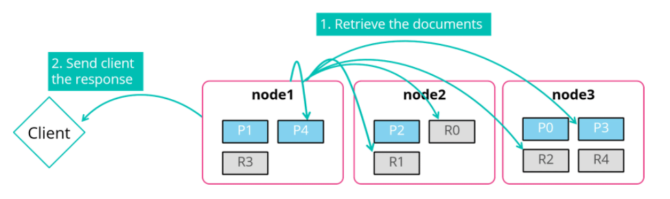

# Distributed Operations

## Anatomy of a Write Operation

### Scenario

You index a document (551) into blogs index which has 5 primary and 1 replica shard.

### Document Routing

This is where the coordinating node, in this case *node2*, decides which shard to put the document into. This uses a simple routing formula which hashes the `_id` of the document and uses that to find a shard. 

The routing schema includes both a user-provided ID and randomly generates IDs picked by Elasticsearch. Default routing gives an even distribution of documents.

This document will be routed to **shard 3**.

### Write Operations on the Primary Shard

The primary shard has to perform any operation first. Here the primary shard is currently on node3 so node2 is going to forward the indexing request

### Replicas are Synced

Node3 indexes the document and forwards the request onto the replicas in parallel. The replicas perform the same operation

### Client Reponse

Node3 lets the coordinating node (node2) know that the write operations was successful on all shards, node2 then sends the response to the client app.

If you have many primary shards, the coordinating node can send all the requests simultaneously. If you have fewer primary shards, you will have to wait for the requests to be complete. More primary shards is better if indexing.

### Updates and Deletes

The process of an `_updates` or `DELETE` is similar to indexing. an `_update` has 3 steps:

1. The source of teh current document is retrieved
2. The current version of the document is deleted
3. Then a merged new version of the entire document is indexed

### The `refresh_interval` Setting

Newly indexed documents are **not searchable** until a **refresh** occurs. By default, it can take up to a second.

The `refresh_interval` setting controls this behaviour. It is a dynamic index level setting.

### The `refresh` parameter

This controls the refresh behaviour on a per request basis.

* `false`: any changes to the document are not visible immediately, and it the default value
* `true`: forces a refresh in the affected primary and replica shards so that the changes are visible immediately
* `wait_for`: synchronous request that waits for a refresh to happen
***

## Anatomy of a Search

With distributed searching you have to search for hits in a copy of every shard in the index and then combine them into a single, sorted list of documents.

In this case node1 (coordinating node) needs to figure out how many primary shards are involved in order to figure out what to access.

## The Query Phase

The initial part of a search is referred to as the **query phase**. The query is broadcast to all copies of every shard in the index, and each shard performs the query locally.

Each shard returns the doc IDs and sort values of its top hits to the coordinating node. This then merges these to create a globally sorted list of results.

### The Fetch Phase

Now the coordinating node has the doc IDs of the top hits, it can now fetch the documents and return these to the client app.

***

# Summary

* A search consists of a query phase and a fetch phase
* By default, the id of a document is considered when determining which shard of the index to route the document to
* A shard is a single instance of Lucene that holds data