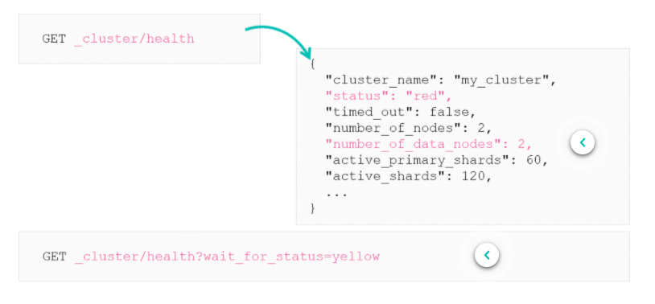

# HTTP Response and Shard Allocation Issues

## Elasticsearch Responses

As Elasticsearch uses REST APIs all responses will contain 2 things:
1. HTTP response status: 200, 201, 404 and 501 - This number tells you if the request has been successful or not.
2. Response body


***

## Common HTTP Errors

Here are some common errors that can occur


***

## Understanding the Index Response Body

**delete**, **index**, **create**, and **update** operations return shard information like this:


* total - how many shard copies (primary and replica shards) the index operation should be executed on.
* successful - the number of shard copies the index operation successfully executed on
* failed - the number of shard copies the index operation failed on
* failures - in case of failures, an array that contains related errors

If the response looks like this:

```
"_shards": {
    "total": 2,
    "successful": 1,
    "failed": 0
},
```

This means that one replica is not available, so its not successful nor failed.
***

## Understanding the Search Response Body

Search responses are similar to the index responses, but search is only executed in one copy.


* total: number of shards the search should be executed on.
* successful: number of shards the search succeeded on
* skipped: number of shards that cleverly avoided search execution because they contain data which cannot possibly match the query
* failed: number of shards the search failed on
***

## Finding Health Issues

If your cluster is having issues, one thing to try is get the cluster health and see if any nodes are down:



`wait_for_status` blocks operations against that node until the status of the cluster becomes yellow or green.
***

## Drilling Down to Indices

Red cluster means at least one red index. Check the health at index level to drill down.


* So in this example, you should have 5 primary shards but it only shows 2, need to go down another level to see whats going on.
***

## Health of a Specific Index

Before going into shard information, we should check the index first. May give us some information.


This checks the health of the "my_index" index.


This can be helpful but extremely detailed. We can see shard 0 has a status of red, but why?
***

## Cluster Allocation Explain API

Having one or more **UNASSIGNED** primary shard(s) means the cluster isn't in a good state, failures can often occur.

Use Cluster Allocation API (explain API) to help locate **UNASSIGNED** shards.

```
GET _cluster/allocation/explain
```

The response lists UNASSIGNED shards and an explanation.


We can get allocation details of a specific shard in a specific index.

```
GET _cluster/allocation.explain
{
    "index": "my_index",
    "shard": 0,
    "primary": true
}
```
***

# Summary

* Every read or write operation returns shard information, such as the number of shards it should be executed on
* A cluster's health reports various statistics and the status of the cluster
* The Cluster Allocation API helps to locate UNASSIGNED shards