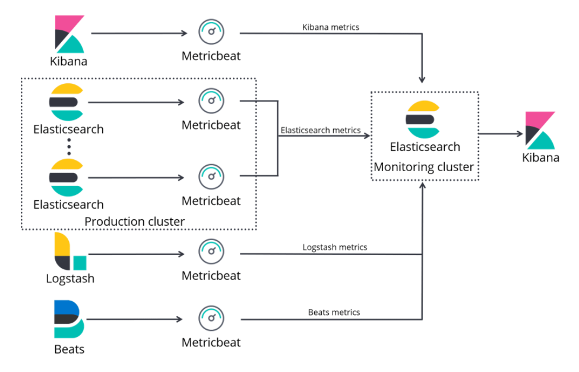
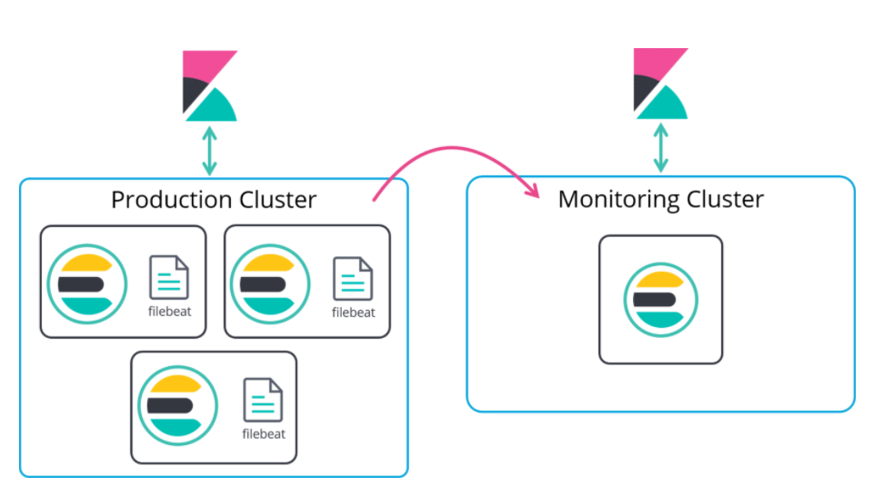
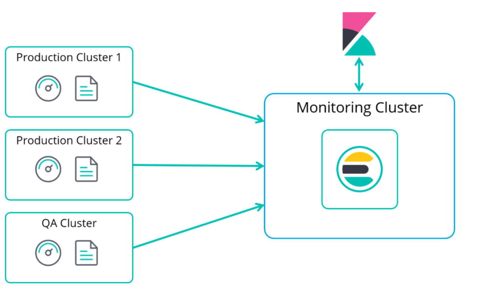

# Monitoring

## Elastic Monitoring

Monitoring keeps tabs on Elasticsearch to make sure its running correctly. Use Metricbeat to collect metrics and Filebeat to collect logs. Once stored we can access a collection of dashboards to assess the status of the cluster.

Recommended way is to set up a dedicated cluster for monitoring the metrics data sent by the monitored cluster. Advantages:

1. It reduces the load and storage on the monitored clusters
2. It keeps access to monitoring even for unhealthy clusters
3. It supports segregation of duties, i.e., separate security policies
***

## Monitoring with Metricbeat

To collect metric information from your cluster, you need to deploy Metricbeat on every host you want to monitor. Metricbeat is a lightweight agent for shipping metric data, it collects metrics from each component on those hosts and send them to the monitoring cluster.

This shows Metricbeat collecting data from Kibana, Elasticsearch, Logstash, and Beats and shipping it to the monitoring cluster which also contains an instance of Elasticsearch which stores the data.


***

## Deploy and configure Metricbeat

To deploy Metricbeat and enable collection of data, you must set `xpack.monitoring.collection.enabled` to `true`. Then install Metricbeat on each host in the cluster. To monitor Elasticsearch you would use:

```
./metricbeat modules enable elasticsearch-xpack
```

Metricbeat will need to be configured on each host, to tell it what metrics to collect and where to send the data to. Finally, you need to disable the legacy monitoring feature by setting `xpack.monitoring.elasticsearch.collection.enabled` to `false`.
***

## Monitoring logs with Filebeat

In addition to collecting metric data, you can also collect Elasticsearch logs and send them to your monitoring cluster.



These are the types of logs you can monitor:

* Audit logs which contain security-related events
* Deprecation logs which contain deprecated actions
* GC logs which contain information about garbage collection
* Server logs which contain the Elasticsearch Log4j2 logs
* Slow logs which contain information about indexing and search operations that are running above a specific threshold

Important thins about collecting and indexing logs, they can come in either structure (JSON) and unstructured (plain text) formats. You must use structured otherwise they might not appear in the appropriate context in Kibana.

Deploying Filebeat is similar to Metricbeat, install it on each host and then configure to tell it what to collect and where to send the data.

```
./filebeat modules enable elasticsearch
```

Followed by:

```
./filebeat setup -e
```

Then just start Filebeat on each node.
***

You can monitor multiple clusters using one dedicated monitoring cluster


***

## Dashboards

There is built in dashboards in Kibana, just go to Stack Monitoring in Kibana. You can drill down into nodes, shards, JVM heap usage and amount of indices.
***

# Summary

* You can monitor Elasticsearch with the Elastic stack by collecting metrics and logs using Metricbest and Filebeat, respectively.
* The best practice is to use a dedicate cluster for Monitoring
* Once you start collecting monitoring data, you can use the built-in Kibana dashboards to analyze that data