# Diagnosing Performance Issues

## The cat API

the `_cat` API is a wrapper around many of the Elasticsearch JSON APIs, including stats APIs. This command displays data in an easier to read format:

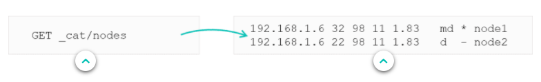

This API is also command-line tool friendly, and helpful for simple monitoring. You can implement your own monitoring and alerting, (Elasticsearch requires a license). Can use Nagios for that information and implement other technologies to help with monitoring.
***

## Specifying Columns

All `_cat` commands accept a query string parameter 'help' to see all the headers and information they provide. "**v**" parameter means "*verbose*", will give column names. "**h**" parameter specifies which columns to retrieve. "*" retrieves all columns.

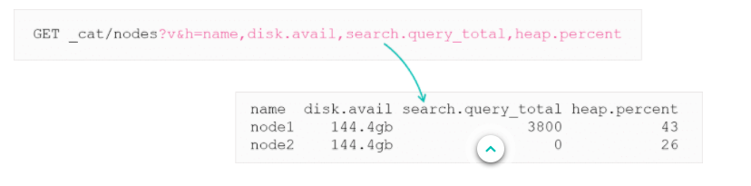
***

## Pending Tasks

This API shows cluster-level changes that have not yet been executed. As the cluster is changing all the time this is often a blank response, but if something is hanging/taking a long time, then this API will return what is going on.

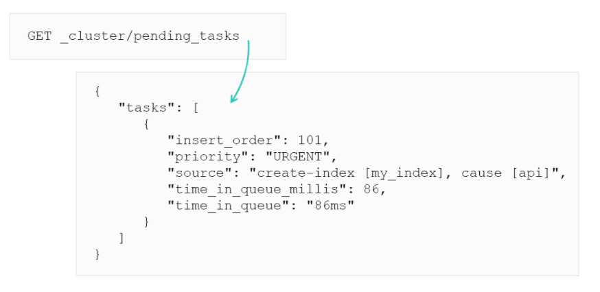
***

## Task Management API

This API shows tasks running in your nodes. Everything from re-indexing to search requests. Provides a nice view on how busy a cluster is.

> Can also cancel tasks using this API

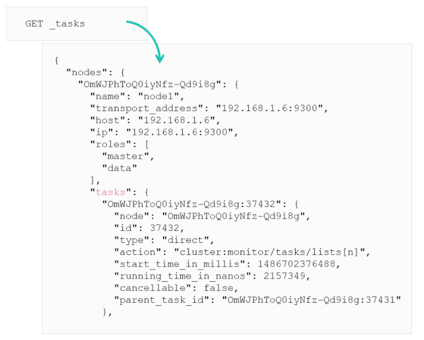
***

## Identifying running tasks

`X-Opaque-id` header can track certain calls or associate certain tasks with the client that started them. E.g., services might take longer than expected. You cna change your app to bind your customer's ID to all the tasks they execute in the cluster for end-to-end traceability.

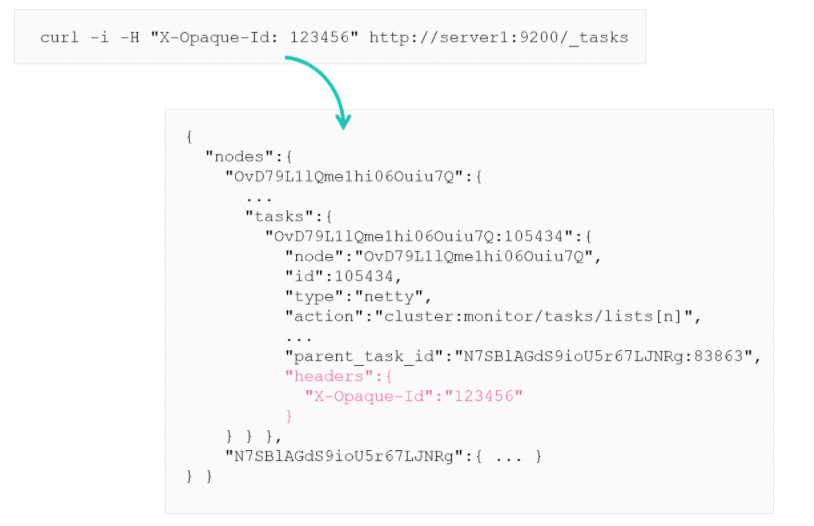
***

## Thread Pool Queues

A node holds several thread pools to improve how thread memory consumption is managed. Many pools have queues associated with them, which allows pending requests to be held. If Elasticsearch is overloaded you will receive a 429 status code, because the thread pools are full. To inspect thread pools you can use: 

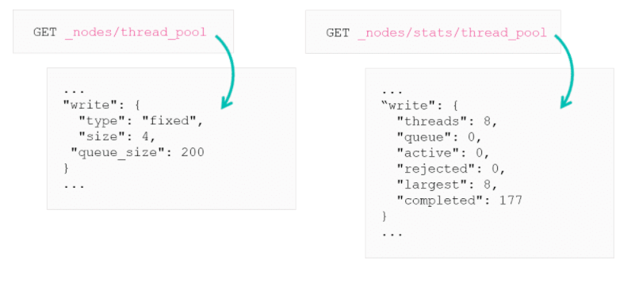

`_cat` can be used with thread pools too. Makes it pretty.

Full queue good or bad? Depends whats going on, bulk API then its fine.
However if your search queue is full, this will be a problem. This can happen because there are too many searches and Elasticsearch is getting overwhelmed.

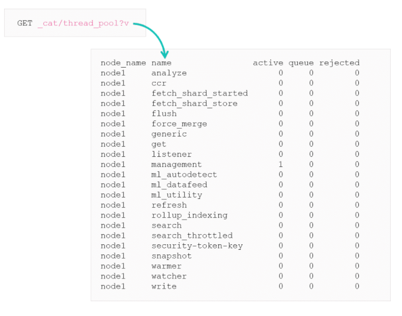
***

## The hot_threads API

This API allows you to get a view of the current hot threads on each node. You can get thread for all nodes or a specific node. If a thread is hanging you can get information on why this is happening.

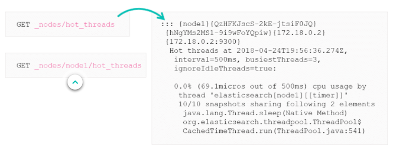
***

## The Indexing Slow Log

This captures the information on long-running index operations into a log file. Logs are indexing events that take longer than configured thresholds. The setting is `index.indexing.slowlog`, this contains thresholds for warning, information, debug and trace level.

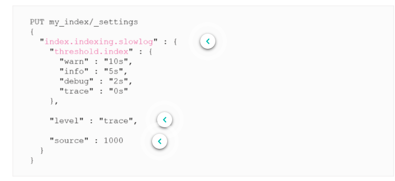
***

## The Search Slow Log

Captures information about long-running searches. Based on the query and fetch phases.

The log file is configured by in log4j2.properties but is disabled by default. Useful but limited since it logs per shard. Packetbeat may be a better solution.

Code below shows everything is set to "info" and thresholds are defined. All queries that take longer than 5 seconds for the query phase or 800 milliseconds for the fetch phase will be logged.

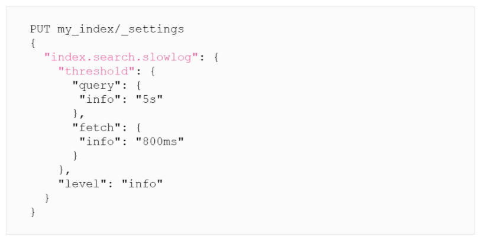
***

## The Profile API

Can be used to inspect and analyse search queries. To enabled set the profile to true and when you run it, you get a large JSON response with information about your query

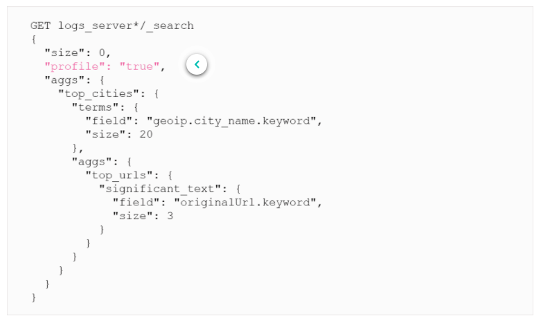
***

## The Profile Response

The response is the big JSON below, which can be hard to read.

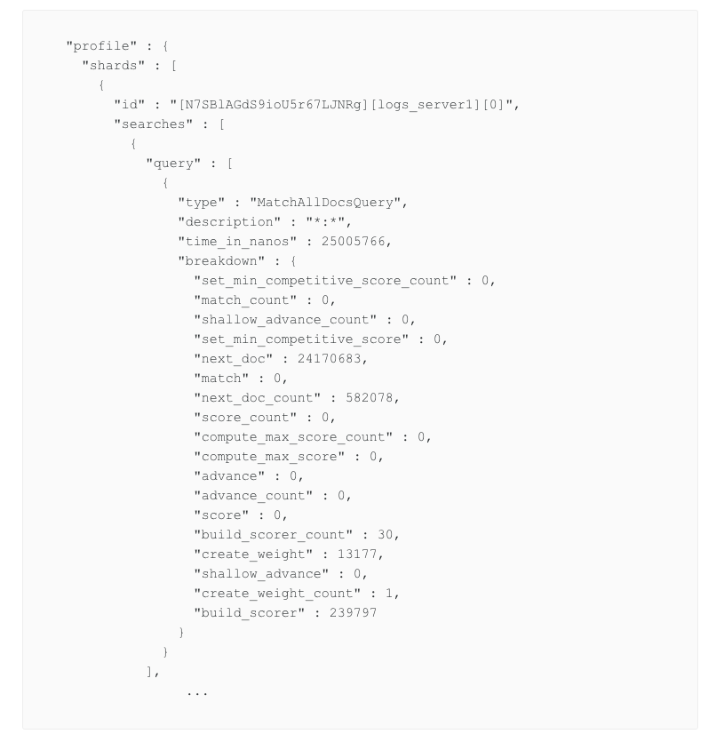
***

## Kibana Tabs

The search profiler tab in kibana will convert the hard to read JSON into a more readable tabular format, breaking down each step in a search/aggregation per shard.

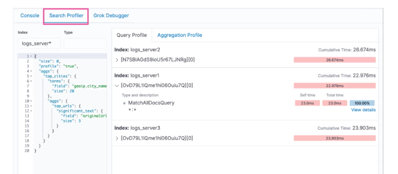
***

## Circuit Breakers

Elasticsearch will always prevent operations from causing memory loss errors (OutOfMemoryError) by specifying a limit on how much memory can be used. Circuit breakers:
 * parent circuit breaker
 * field data circuit breaker
 * request circuit breaker
 * in-flight requests circuit breaker
 * accounting requests circuit breaker
 * script compilation circuit breaker
 ***

 # Summary

 * You can use the tasks API to see cluster-level changes that have not been executed yet and the X-Opaque-Id header to track certain tasks
* Slow logs, thread pools, and hot threads can help you diagnose performance issues
* You can profile your search queries and aggregations to see where they are spending time
* Elasticsearch sets several circuit breakers to prevent out of memory errors