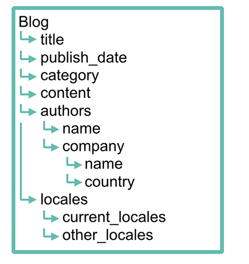
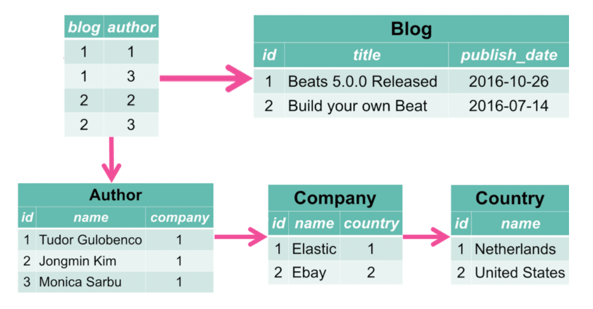
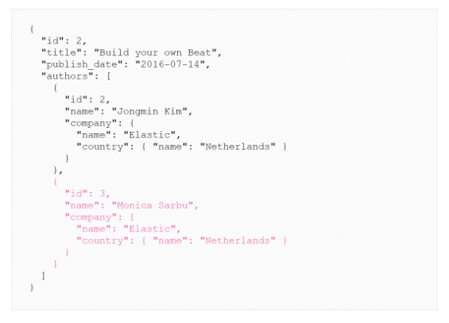
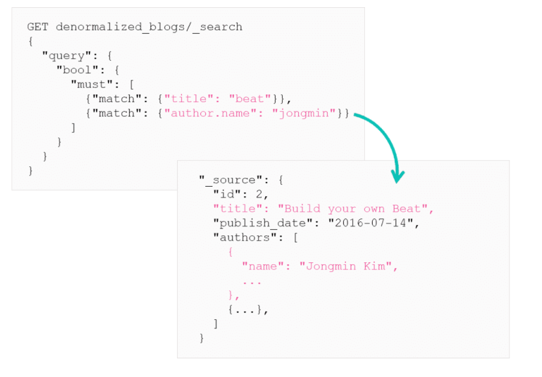
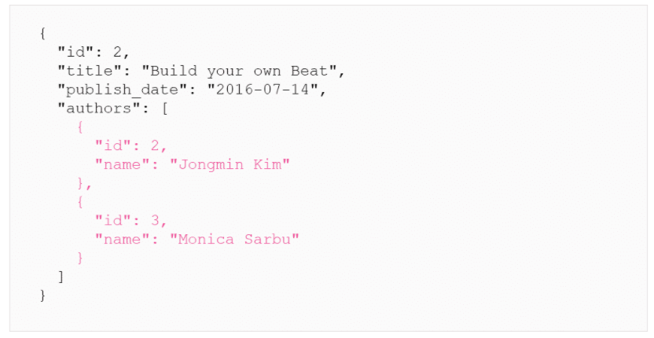
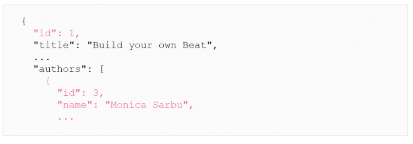

# Denormalisation

## What is Denormalisation?

Denormalising your data refers to "flattening" you data. The idea is to have all the info related to an entity gathered at the same place. You need to store redundant copies of data in each document, instead of using some type of relationship between different indexes.

In a relational database storing redundant information is bad practice, but in terms of Elasticsearch it is more performant, as there is no need to perform expensive joins when querying. `_source` is compressed which reduces the disk waste.
***

## Example of Denormalisation

Elastics blog site contains various information, title and content, also has additional metadata such as publish date, category, locales, or authors.


Data model of a blogs object:



Example of blogs object as a class:

```
public class Blog {
  private String title;
  private String category;
  private String content;

  private Date publish_date;

  private Locales locales;
  
  private Author[] authors;

  ...

}
```

How this would be stored in a database. This is normalised as you don't want duplicates.



To ingest this data into Elasticsearch, it will need to be denormalised. The author information, including company and country, will need to be duplicated.

The data from the database will be ingested as only two documents. Notice both documents contain redundant information about author Monica Sarbu.

Blog 1:


Blog 2:


***

## Advantage of Denormalisation

Denormalised data can be searched in a single query, without the need of expensive lookups as the data is all in one place. Elasticsearch is optimised for search even with data modeling.


***

## Tips for Denormalising Data

### Denormalise Useful Fields

There is no need to denormalise every field, you should only denormalise fields that you care about and are interested in, for search for example. Blog 2 can be simplified by not including the ID for company and country. We don't need to index fields that we are not going to search on, so we can remove fields we don't want.


***

### Keeping Denormalised Data Consistent

There is no mechanism to keep the denormalised data consisten with the original document. Avoid denormalising data that is likely to change frequently.

When denormalizing data that changes, you should ensure that there is 1 and only 1 authoritative source for the data. If you do denormalize data that might change, it can help to also denormalize a field that does not change, like an _id.


***

# Summary

* Denormalizing your data refers to “flattening" your data and typically provides the best performance in terms of how your data is modeled
* When modeling your documents, prefer denormalization whenever possible