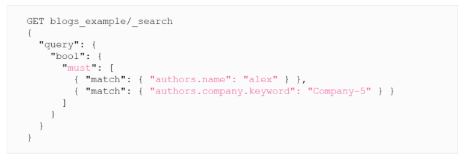
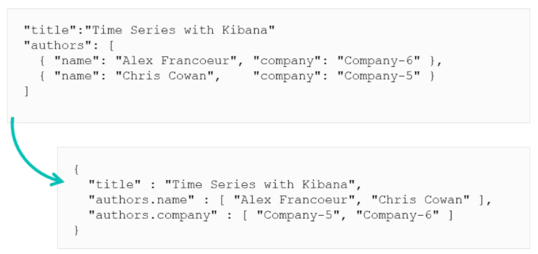

# Nested and Join Data Types

## The Need For Nested Type


These two blogs are indexed, written by different authors.
***


We search the index for **alex** that works at **Company-5** using a `bool` query to combine them
***


Both results will be returned.
***


The `name` and `company` fields are JSON inner objects of the `authors` array field. Elasticsearch flattens these objects on ingest to match Lucene internals requirements. The relationship between `name` and `company` is lost.

To solve this issue nested data types are needed.
***

## The Nested Data Type

This type allows arrays of objects to be indexed and queried independently of each other. You need to use nested if you need to maintain the relationship of each object in the array.

Syntax:
```
"mappings": {
    "_doc": {
        "properties": {
            "outer_object": {
                "type": "nested",
                "properties": {
                    "inner_field": "TYPE",
                    ...
                }
            }
        }
    }
}
```

To fix the example above we need to define the `authors` field as `nested` to maintain the relationship between `name` and `company` fields within `authors`.

```
PUT blogs_example
{
    "mappings": {
        "properties": {
            "title": {
                "type": "text"
            },
            "authors": {
                "type": "nested",
                "properties": {
                    "name": {
                        "type": "text"
                    },
                    "company": {
                        "type": "keyword"
                    }
                }
            }
        }
    }
}
```

> Warning: By default, Elasticsearch limits the number of nested fields to 50. You can change it by updating the parameter `index.mapping.nested_fields.limit`.
***

## The Nested Query

To run a query on this data now, as its been created with a specific data structure, you need to use a nested query.


***

## The Nested Aggregation

The same issue happens with aggregation:


Alex Francoeur does not work at Company-5. To solve this you must use the nested type and nested aggregation. The nested bucket allows you to aggregate inner documents independently from each other.

```
GET blogs_example/_search
{
    "size": 0,
    "aggs": {
        "nested_authors": {
            "nested": {
                "path": "authors"
            },
            "aggs": {
                "companies": {
                    "terms": { "field": "authors.company.keyword" },
                    "aggs": {
                        "authors": {
                            "terms": { "field": "authors.name.keyword"}
                        }
                    }
                }
            }
        }
    }
}
```
***

## Join Data Type

If you have to do very frequent updates to a document and are experiencing performance issues, then the Join Data Type might be the solution. This completely separates 2 objects while maintaining their relationship, the parent and child are completely separate documents but from the same index. You can update on of the documents without affecting the other. It is possible to index both parent and child on the same shard, so after indexing the parent you need to use the parent id to index the child. Use `routing` when indexing a new document.

```
PUT my_index/_doc/3?routing=parent_id
```
> Joing data type add overhead at query time in terms of memory and computation.
***

## Choosing a Technique for Relationships


***

## Kibana Considerations

Kibana has limited support for nested types or parent/child relationships. Vega or using a community-based plugin is the only option. So either use nested or parent/child or you can use visualisations.
***

# Summary

* The nested type allows arrays of objects to be indexed and queried independently of each other
* Updating a nested object requires a complete reindexing of the root object AND all of its other nested objects
* The key benefit of a join datatype is the ability to modify a child object independently of the parent
* Avoid the join data type