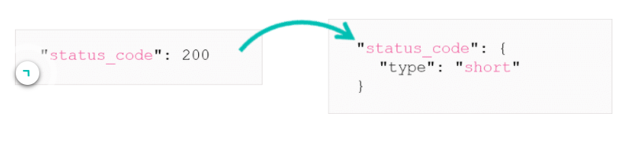
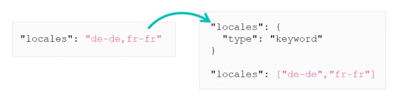
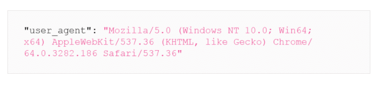
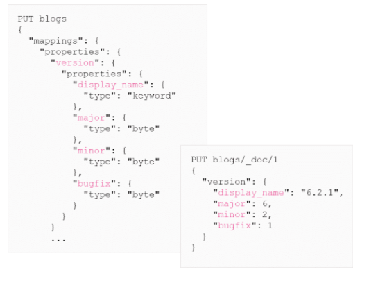
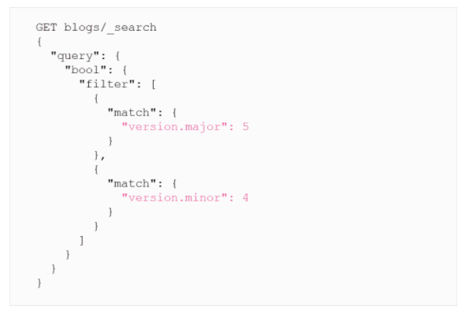
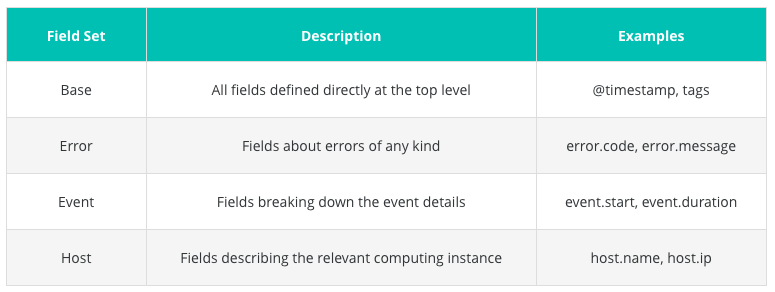
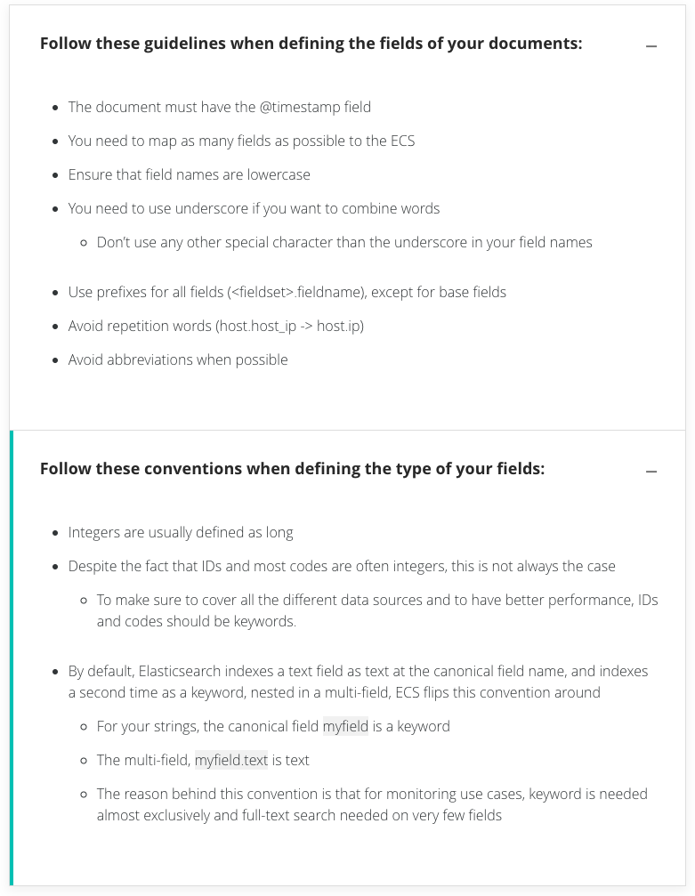
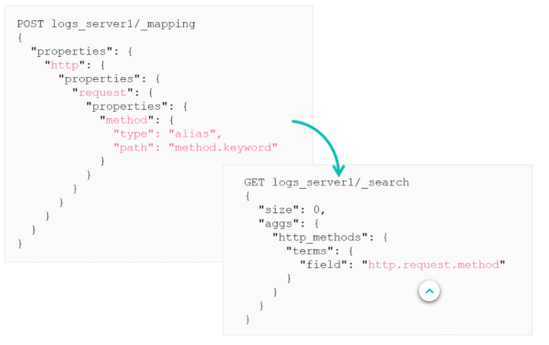

# Field Modeling and the Elastic Common Schema

## The Need for Modeling

Elasticsearch will dynamically create a mapping when you index a document. For a document containing mostly text the fields will be mapped to `text` and `keyword`. This default behaviour is no optimal and most of the time you will need to customise this mapping for the best performance.
***

## Easy Fixes

Some fixes are easy. For example, you can choose a more appropriate data type for the float or integer of your documents.



You can clean-up some string fields too. By default all string fields are indexed as `text` and `keyword`, you don't always need both. Indexing every string twice will slow down indexing and take up more disk space.
*** 

## Complex Fixes

Some fixes are more complex. For example, the `locales` field in the example below is a comma-separated list of values, By default, this will be indexed as only one long string which contains all the different values. This would be easier to search as an array.



Some fields need to have an extra level of granularity to make it easier to search. Look at the `user_agent`field.



This contains a lot of information about the system and browser and can be difficult to search. This needs to be decomposed into more granular fields.
***

## Granular Fields

If you want to include a version of something like below this would be hard to search on as a user couldn't really search for a version like "5.2".

```
"version": "6.2.1"
```

There are 2 potential fixes for this

* Use some regular expression
* map and index the field better



Adding a level of granularity can make it much simpler to answer a question about a field.



Now a simple `bool` query can be used to search and we can avoid using a regular expression.
***

## Field Name and Type Convention

### The Need for Conventions

If a document is indexed 3 times by 3 different servers and they all write the user id in a different way, Elasticsearch will have a hard time querying. It will happily index them into 3 separate indices, but when it comes to querying some indices will return the result while some will not search for it or fail. This is were the Elastic Common Schema comes in.
***

## Elastic Common Schema

The ECS is an open-source specification that defines a common set of document fields for data ingested into Elasticsearch. It is design to support uniform data modeling, enabling you to centrally analyse data from diverse sources with both interactive and automated techniques while giving you a lot of flexibility to add custom fields if needed.

* The ECS **Core** Fields - represent the fields that are most common across all use cases, and you should focus on populating these fields first.
* ECS **Extended** Fields - represents any fields that are not part of the core fields and they may apply to more narrow use cases.
***

## Field Set

ECS defines multiple groups of related fields, called **field sets**. With the exception of the base field sets, every other set is an object which groups the related fields. Below is an example of different field sets. Complete list [here](https://www.elastic.co/guide/en/ecs/current/ecs-field-reference.html)


***

## Guidelines and Convention

When working with ECS, it is best to follow guidelines so that you have consistency in the modeling of your fields across various use cases.


***

## Alias Data Type

These conventions help in building visualisations and dashboards across various data sets. But if you have only just started following the convention and have existing data that doesn't follow to convention, then there may be some trouble in creating visualisations. One solution is to reindex, but this could take a while depending on the size of the index. Another solution is to use alias'.

The alias data type defines an alternate name for a field that links to the original field. A field alias can only have 1 target and there are some restrictions on the target of a field alias:

* It must be a concrete field (not an object or an alias)
* It must exist at the time the alias is created
* If nested objects are defined, the alias must have the same nested scope as its target.

Alias will have the same additional cost as any other field, they count towards `index.mapping.total_fields.limit` and make mapping grow. It is not possible to remove an alias.

Here is an example of adding an alias to `method.keyword` to be `http.request.method`.


***

# Summary

* Carefully modeling your data allows you to get the most out of it
* Naming conventions facilitate the analysis of data from diverse sources
* ECS is designed to support uniform data modeling and it specifies field names and datatypes
* The alias data type allows you to define an alternate name for a field in the index