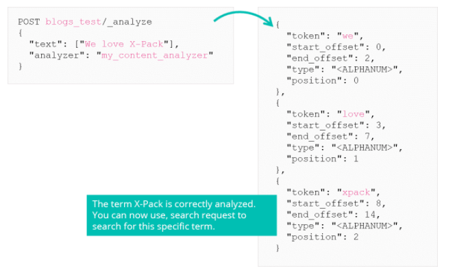

# Analysers

## Role and Anatomy of an Analyser

When indexing a text field it is passed through an analyser, this breaks the words into tokens, removes some words, and changes some words. Final tokens are then indexed into an inverted index. Similarly the text used in a query is passed through the same analyser. 

An analyser is made up of 3 parts. 

1. The original string is going through different character filters
    1. Transform the string by adding, removing, or changing characters
    2. e.g. remove html from text.
    3. Analyser may have 0 or more char filters
2. tokenizer - break up the strings into individual tokens following a given rule.
3. token filters - may add remove or change tokens
    1. e.g. lower case token filter coverts all tokens to lower case
***

## The Analyze API

The default analyzer is the standard analyzer. Elasticsearch has many [built in analyzers](https://www.elastic.co/guide/en/elasticsearch/reference/current/analysis-analyzers.html). To test behaviour of different analyzers use the `_analyze` API.

Following example tests the english analyzer on the given text.

```
GET _analyze
{
    "analyzer": "english",
    "text": "Tuning Go Apps in a Beat"
}
```

The result will give you different tokens compared to the standard analyzer. 


***

## Custom Analyzer

Sometimes the analyzers available will do something you don't expect and you need to build custom rules for an analyzer.


For example, if you are indexing blogs, and one of those blogs are about "X-Pack", then the standard analyzer will tokenise this to "x" and "pack".

### Defining a Custom Analyzer


Above is how to define a custom analyzer, this creation happens in the settings of an index.

### Using a Custom Analyzer


After defining your custom analyzer, you can use this in a text field.

### Test a Custom Analyzer



It is good practice to test a custom analyzer before indexing any data, just to ensure the behaviour is what you expect it to be.
***

## The Snowball Stemmer

The snowball token filter is a filter that stems words in over 20 languages. This allows you to create a single token for words that are sharing the same root (followed and follows).

Custom analyzer:

```
PUT blogs_test2
{
    "settings": {
        "analysis": {
            "char_filter": {
                "xpack_filter": {
                    "type": "mapping",
                    "mappings": ["X-Pack => XPack"]
                }
            },
            "filter": {
                "my_snowball_filter": {
                    "type": "snowball",
                    "language": "English"
                }
            },
            "analyzer": {
                "my_content_analyzer": {
                    "type": "custom",
                    "char_filter": ["xpack_filter"],
                    "tokenizer": "standard",
                    "filter": ["lowercase", "stop", "my_snowball_filter"]
                }
            }
        }
    }
}
```

After defining this custom analyzer, you can test it with `_analyze` API.


Every token has been reduced to its root. So a user can search for **provide** and have responses about **providers** or **provided**.
***

## Order matters in filters

Filters are defined in a given order when creating a custom analyzer. This order reflects how the analyzer applies it. Different orders yield different results.


***

# Summary

* Strings are analyzed at index and search time
* You can build your own custom analyzer, out of the three building blocks:
    * Character Filters
    * Tokenizer
    * Token Filters
* Use the _analyze API to test an analyzer (or the components individually)