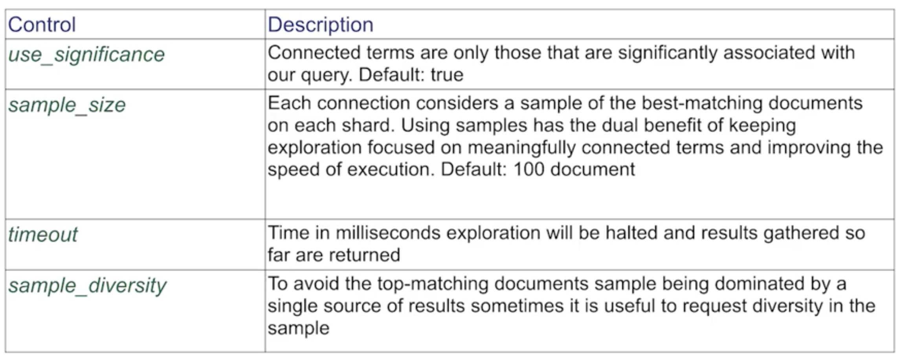
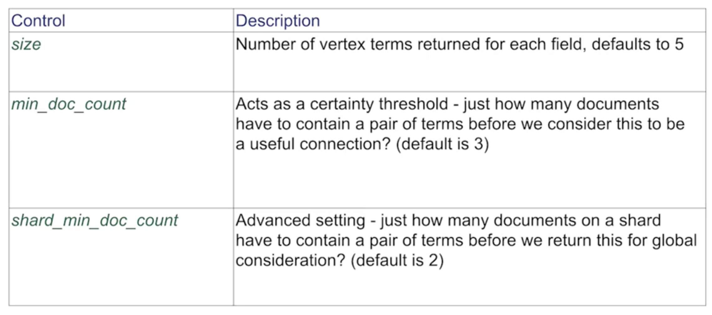

# Elastic Graph

## Overview

Graphs are a set of vertices (circles) and connections between them. Combines graph algorithms and search.

* Explore data relevancy
* Recommendation engine

Can use Kibana to interact with graphs:
* Select relationships to explore
* Find new or existing connections in the data
* Visualise results

***

## Why Graph

* Uses existing Elasticsearch indexes
    * No need to reindex
    * No need to change data models
* Simple architecture
    * No need to deploy a special graph data system
    * Scales with Elasticsearch cluster
* Combine the power of search, relevancy and graph databases
    * Find significant relationships between data

***

## Graphs

* An indexed value is a potential vertex
    * Single value fields such as an email address which can link to other fields
    * array fields such as "licked movies" which can link to itself and other fields
* A relationship forms a connection
    * Not persisted in Elasticsearch
    * Uses aggregation framework to search and connect the vertices
* Graph traversal
    * Graph traversal algorithms prioritise finding meaningful connections in the data

***

## What does meaningful mean?

* Super nodes (Super Connectors)
    * Traditional graphs get distorted by "super nodes"
    * They frequently include these heavily connected vertices during exploration which can distort finding relevant connections
    * When storing connections instead of computing them on-the-fly this becomes a major issue
        * Wisdom of crowds
            * Use sampling and diversity settings to choose which signals we want to summerise
            * Provide a more personalised form of recommendations

***

## Personalised recommendations

Many approaches store edges so they can retrieve an answer for questions like:

* "People who searched for X tend to click on product Y"
    * Provides only a single interpretation of event

* Elastic Graph can find the answer to these questions by searching:
    * "People who searched for X (and ideally were females in London with an age range of 25-40 with interests in product Z) tend to click on product Y"
    * This is computed using aggregations and the search on top of proven graph algorithms

***

## Graph API - programmatic results

* REST interface accepts user graph-exploration criteria as JSON:

```
POST clicklogs/_graph/explore
{
    "query": {
        "match": {
            "query.raw": "midi"
        }
    },
    "vertices": [
        {
            "field": "product"
        }
    ],
    "connections": {
        "vertices": [
            {
                "field": "query.raw"
            }
        ]
    }
}
```

* Find product codes that are significantly associated with searches for "midi" and further, show other queries that led people to these products
* Internally a number of searches with aggregations are then made to build the graph

***

## Query Controls

* Configure controls to the query to tune the graph query results and performance
* Visual and Programmatic



* Programmatic controls
    * Can control each vertices settings too:



***

# Summary

* Graph models data as a web of connections between vertexes
* Use graph to find similarities via co-occurrences between users
* Graph has beautiful, feature-rich visual interactive analytics
* Graph has a powerful API for programmatic analysis
* Graph, as a recommender engine, uses the power of query, aggregation, and graph math to create compelling recommendations